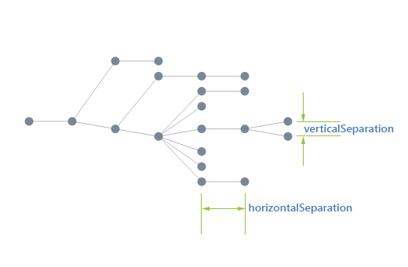
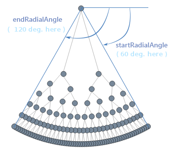
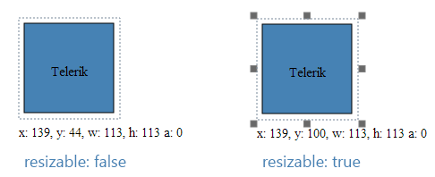
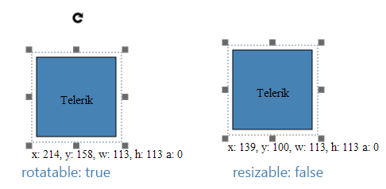
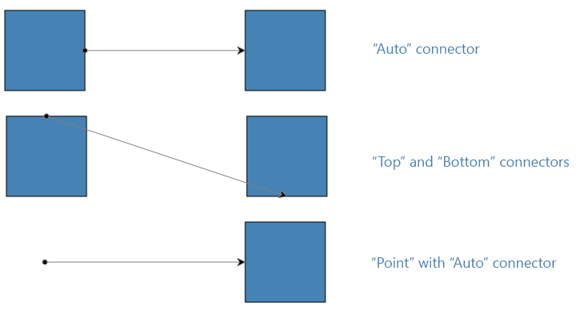

# kendo.dataviz.ui.Diagram

## Configuration

### autoBind `Boolean` *(default: true)*

If set to `false` the widget will not bind to the data source during initialization. In this case data binding will occur when the [change](/api/framework/datasource#events-change) event of the
data source is fired. By default the widget will bind to the data source specified in the configuration.

> Setting `autoBind` to `false` is useful when multiple widgets are bound to the same data source. Disabling automatic binding ensures that the shared data source doesn't make more than one request to the remote service.

#### Example - disable automatic binding

    

    

### zoomRate `Number` *(default: 1.1)*

The scaling factor or the zoom when using the mouse-wheel to zoom in or out.
If zoomRate is less than 1, zooming will be reversed.

> Setting zoomRate of 1 will disable zooming.

### dataSource `Object|Array|kendo.data.DataSource`

See the [dataSource field](#fields-dataSource).

### draggable `Boolean` *(default: true)*

Defines whether items can be dropped on the diagram.

### layout `Object`
The layout of a diagram consists in arranging the shapes (sometimes also the connections) in some fashion in order to achieve an aesthetically pleasing experience to the user. It aims at giving a more direct insight in the information contained within the diagram and its relational structure.

On a technical level, layout consists of a multitude of algorithms and optimizations:

* analysis of the relational structure (loops, multi-edge occurence...)
* connectedness of the diagram and the splitting into disconnected components
* crossings of connections
* bends and length of links

and various ad-hoc calculations which depend on the type of layout. The criteria on which an algorithm is based vary but the common denominator is:

* a clean separation of connected components (subgraphs)
* an orderly organization of the shapes in such a way that siblings are close to another, i.e. a tight packing of shapes which belong together (parent of child relationship)
* a minimum of connection crossings

Kendo diagram includes three of the most used layout algorithms which should cover most of your layout needs - **tree layout**, **force-directed layout** and **layered layout**. Please, check the type property for more details regarding each type.

The generic way to apply a layout is by calling the **layout()** method on the diagram. The method has a single parameter **options**. It is an object, which can contain parameters which are specific to the layout as well as parameters customizing the global grid layout. Parameters which apply to other layout algorithms can be included but are overlooked if not applicable to the chose layout type. This means that you can define a set of parameters which cover all possible layout types and simply pass it in the method whatever the layout define in the first parameter.

### layout.type `String` *(default: "tree")*

The type of the layout algorythm to use. Predefined values are:

* "tree" - Organizes a diagram in a hierarchical way and is typically used in organizational representations. This type includes the radial tree layout, mindmapping and the classic tree diagrams.
* "force" - Force-directed layout algorithm (also known as the spring-embedder algorithm) is based on a physical simulation of forces acting on the nodes whereby the links define whether two nodes act upon each other. Each link effectively is like a spring embedded in the diagram. The simulation attempts to find a minimum energy state in such a way that the springs are in their base-state and thus do not pull or push any (linked) node. This force-directed layout is **non-deterministic**; each layout pass will result in an unpredictable (and hence not reproducible) layout. The optimal length is more and indication in the algorithm than a guarantee that all nodes will be at this distance. The result of the layout is really a combination of the incidence structure of the diagram, the initial topology (positions of the nodes) and the number of iterations.

* "layered" - Organizes the diagram with an emphasis on *flow* and minimizing the crossing between layers of shapes. This layout works well when few components are present and some sort of top-down flow is present. The concept of *flow* in this context being a more or less clear direction of the connections with a minimum of cycles (connections flowing back upstream). Layered graph layout is a type of graph layout in which the nodes of a (directed) graph are drawn in horizontal or vertical layers with the links directed in the complementary direction. It is also known as Sugiyama or hierarchical graph layout. When the graph is a tree the layout reduces to a standard tree layout and thus can be considered as an extension to the classic tree layout.

There are several criteria on which this algorithm is based and which are respected in as far as the incidence structure allows it:
* links have a preferred direction (the complementary direction of the subtype) and attempt to flow as much as possible in this way
* linked nodes try to stay closed to one another (clustering of nodes)
* links crossings should be minimized
* links should be as short as possible (cross a few layers as possible)

The construction of a layered graph drawing proceeds in a series of steps (assuming an horizontal layer from here on):
 + If the input graph is not already a directed acyclic graph, a set of edges is identified the reversal of which will make it acyclic.
 + The nodes of the directed acyclic graph resulting from the first step are assigned to layers, such that each link goes from a higher layer to a lower layer.
 + Edges that span multiple layers are replaced by paths of dummy vertices so that, after this step, each edge in the expanded graph connects two vertices on adjacent layers of the drawing.
 + The nodes within each layer are permuted in an attempt to reduce the number of crossings among the edges connecting it to the previous layer.
 + Each node is assigned a coordinate within its layer, consistent with the permutation calculated in the previous step.
 + The edges reversed in the first step of the algorithm are returned to their original orientations, the dummy vertices are removed from the graph and the vertices and edges are drawn.

### layout.subtype `String` *(default: "down")*

The subtype further defines the layout type by specifying in greater detail the behaviour expected by the layout algorithm. Possible predefined values are:

* "down" - *tree layout* and *layered layout* specific subtype. In the tree layout the root is arranged at the top and its children downwards. For the layered layout the links are directed downwards. This is the default subtype.

* "up" - *tree layout* and *layered layout* specific subtype. In the tree layout the root is arranged at the bottom and its children upwards. For the layered layout the links are directed upwards.
* "left" - *tree layout* *layered layout* specific subtype. In the tree layout the root is arranged at the left and its children sideways to the right. For the layered layout the links are directed to the left.
* "right" - *tree layout* *layered layout* specific subtype. In the tree layout the root is arranged at the right and its children sideways to the left. For the layered layout the links are directed downwards.

* "mindmapHorizontal" - *tree layout* specific subtype. The root sits at the center and its children are spread equally to the left and right.
* "mindmapVertical" - *tree layout* specific subtype. The root sits at the center and its children are spread equally above and below.

* "radial" - *tree layout* specific subtype. The root sits at the center and its children are spread radially around.

* "tipOver" - *tree layout* specific subtype. A special version of the tree-down layout where the grand-children (and iteratively) are arranged vertically while the direct children are arranged horizontally. This arrangement has the advantage that it doesn't spread as much as the classic tree-down layout. See below for a concrete example.

* "horizontal" - *layered layout* specific subtype. The preferred direction of the links is horizontal.
* "vertical" - *layered layout* specific subtype. The preferred direction of the links is vertical.

### layout.horizontalSeparation `Number` *(default: 90)*

Either the distance between the siblings if the tree is up/down or between levels if the tree is left/right. In *tipOver tree layout* this setting is used only for the direct children of the root

### layout.verticalSeparation `Number` *(default: 50)*

Either the distance between levels if the tree is up/down or between siblings if the tree is left/right. This property is **not used** in *tipOver tree layout* but rather replaced with three additional ones - **underneathVerticalTopOffset**, **underneathVerticalSeparation** and **underneathHorizontalOffset**

### layout.radialFirstLevelSeparation `Number` *(default: 200)*

Controls the distance between the root and the immediate children of the root. *This setting is specific to the radial tree layout.*

### layout.radialSeparation `Number` *(default: 150)*

Defines the radial separation between the levels (except the first one which is defined by the aforementioned radialFirstLevelSeparation). *This setting is specific to the radial tree layout.*

### layout.startRadialAngle `Number` *(default: 0)*

Defines where the circle/arc starts. The positive direction is **clockwise** and the angle is in **degrees**. *This setting is specific to the radial tree layout.*

### layout.endRadialAngle `Number` *(default: 360)*

Defines where the circle/arc ends. The positive direction is **clockwise** and the angle is in **degrees**. *This setting is specific to the radial tree layout.*

### layout.underneathVerticalTopOffset `Number` *(default: 15)*

Defines the vertical separation between a parent and its first child. This offsets the whole set of children with respect to its parent. *This setting is specific to the tipOver tree layout.*

### layout.underneathVerticalSeparation `Number` *(default: 15)*

Defines the vertical separation between siblings and sub-branches. *This setting is specific to the tipOver tree layout.*

### layout.underneathHorizontalOffset `Number` *(default: 15)*

Defines the horizontal offset from a child with respect to its parent. *This setting is specific to the tipOver tree layout.*

### layout.iterations `Number` *(default: 300)*

The number of times that all the forces in the diagram are being calculated and balanced. The default is set at 300, which should be enough for diagrams up to a hundred nodes. By increasing this parameter you increase the correctness of the simulation but it does not always lead to a more stable topology. In some situations a diagram simply does not have a stable minimum energy state and oscillates (globally or locally) between the minima. In such a situation increasing the iterations will not result in a better topology.

In situations where there is enough symmetry in the diagram the increased number of iterations does lead to a better layout. In the example below the 100 iterations was not enough to bring the grid to a stable state while 300 iterations did bring all the nodes in such a position that the (virtual) energy of the diagram is a minimum.

*This setting is specific to the force-directed layout*

### layout.nodeDistance `Number` *(default: 50)*

In the **force-directed layout** this setting defines the optimal length between 2 nodes, which directly correlates to the state of the link between them. If a link is longer than there will be a force pulling the nodes together, if the link is shorter the force will push the nodes apart. The optimal length is more and indication in the algorithm than a guarantee that all nodes will be at this distance. The result of the layout is really a combination of the incidence structure of the diagram, the initial topology (positions of the nodes) and the number of iterations.

In the **layered layout** it defines the minimum distance between nodes on the same level. Due to the nature of the algorithm this distance will only be respected if the the whole crossing of links and optimimzation does not induce a shift of the siblings.

*This setting is specific to the force-directed layout and layered layout*

### layout.grid `Object`

Each layout algorithm has a different set of parameters customizing the layout but they also all have a common collection of parameters which relate to the way 'pieces' of a diagram are organized.

A diagram can have in general disconnected pieces, known as components, which can be organized in a way independent of the way a component on its own is arranged. In the picture above, this is one diagram consisting of four components.

When you apply a certain layout an analysis will first split the diagram in components, arrange each component individually and thereafter organize the components in a grid. The common parameters referred above deal with this grid layout, they define the width, margin and padding of the (invisible) grid used to organize the components.

### layout.grid.width `Number` *(default: 1500)*

Defines the width of the grid. The bigger this parameter the more components will be organized in an horizontal row. How many components really depends on your diagram and they type of layout applied to each component. The default is set to 800.

### layout.grid.offsetX `Number` *(default: 50)*

Defines the left offset of the grid layout. The default is 50.

### layout.grid.offsetY `Number` *(default: 50)*

Defines the top offset of the grid layout. The default is 50.

### layout.grid.componentSpacingX `Number` *(default: 50)*

Defines the horizontal spacing between each component. The default is 50.

### layout.grid.componentSpacingY `Number` *(default: 50)*

Defines the vertical spacing between each component. The default is 50.

### layout.layerSeparation `Number` *(default: 50)*

The height (in a vertical layout) or width (in a horizontal layout) between the layers.

### template `String|Function` *(default: "")*

The [template](/api/framework/kendo#methods-template) which renders the content of the shape when bound to a dataSource. The names you can use in the template correspond to the properties used in the dataSource. See the dataSource topic below for a concrete example.

### resizable `Boolean` *(default: true)*

This defines whether the shapes can be resized. If set to false the adorner will not show the resizing thumbs, as can be seen below;

### rotatable `Boolean` *(default: true)*

This defines whether the shapes can be rotated. If set to false the adorner will not show the rotating thumb, as can be seen below;

### connectionDefaults `Object`

Defines the connections configuration.

### connectionDefaults.stroke `Object`

Defines the stroke configuration.

### connectionDefaults.stroke.color `String`

Defines the stroke or line color of the connection.

### connectionDefaults.stroke.width `Number`

Defines the stroke width of the connection.

### connectionDefaults.hover `Object`

Defines the hover configuration.

### connectionDefaults.hover.stroke `Object`

Defines the hover stroke configuration.

### connectionDefaults.hover.stroke.color `String` *(default: "#70CAFF")*

Defines the highlight color when the pointer is hovering over the connection.

### connectionDefaults.startCap `String` *(default: "FilledCircle")*

The start cap (arrow, head or decoration) of the connection:

* "none": no cap
* "ArrowStart": a filled arrow
* "FilledCircle": a filled circle

### connectionDefaults.endCap `String` *(default: "ArrowEnd")*

The start cap (arrow, head or decoration) of the connection:

* "none": no cap
* "ArrowEnd": a filled arrow
* "FilledCircle": a filled circle

Note that you can also use the "ArrowStart" for the endCap but its direction will be inversed.

### connections `Array`

Defines the connections configuration.

### connections.stroke `Object`

Defines the stroke configuration.

### connections.stroke.color `String`

Defines the stroke or line color of the connection.

### connections.stroke.width `Number`

Defines the stroke width of the connection.

### connections.hover `Object`

Defines the hover configuration.

### connections.hover.stroke `Object`

Defines the hover stroke configuration.

### connections.hover.stroke.color `String` *(default: "#70CAFF")*

Defines the highlight color when the pointer is hovering over the connection.

### connections.startCap `String` *(default: "FilledCircle")*

The start cap (arrow, head or decoration) of the connection:

* "none": no cap
* "ArrowStart": a filled arrow
* "FilledCircle": a filled circle

### connections.endCap `String` *(default: "ArrowEnd")*

The start cap (arrow, head or decoration) of the connection:

* "none": no cap
* "ArrowEnd": a filled arrow
* "FilledCircle": a filled circle

Note that you can also use the "ArrowStart" for the endCap but its direction will be inversed.

### connections.points `Array`

Sets the intermediate points (in global coordinates) of the connection. It's important to note that currently these points cannot be manipulated in the interface.

#### Example - setting intermediate connection points

### connections.points.x `Number`

Sets the X coordinate of the point.

### connections.points.y `Number`

Sets the Y coordinate of the point.

### shapeDefaults `Object`

Defines the shape options.

### shapeDefaults.editable `Boolean` *(default:true)*

Specifies if the shape is editable by the user.

### shapeDefaults.rotatable `Boolean` *(default:true)*

Specifies if the user is allowed to rotate the shape.

### shapeDefaults.resizable `Boolean` *(default:true)*

Specifies if the shape is resizable.

### shapeDefaults.path `String`

The path option of a Shape is a description of a custom geometry. The format follows the standard SVG format (http://www.w3.org/TR/SVG/paths.html#PathData "SVG Path data.").

### shapeDefaults.stroke `Object`

Defines the stroke configuration.

### shapeDefaults.stroke.color `String` *(default: "Black")*

Defines the color of the shape's stroke.

### shapeDefaults.stroke.width `Number` *(default: 1)*

Defines the thickness or width of the shape's stroke.

### shapeDefaults.stroke.dashType `String`

The dash type of the shape.

The following dash types are supported:

* "dash" - a line consisting of dashes
* "dashDot" - a line consisting of a repeating pattern of dash-dot
* "dot" - a line consisting of dots
* "longDash" - a line consisting of a repeating pattern of long-dash
* "longDashDot" - a line consisting of a repeating pattern of long-dash-dot
* "longDashDotDot" - a line consisting of a repeating pattern of long-dash-dot-dot
* "solid" - a solid line

### shapeDefaults.type `String` *(default: "rectangle")*

Specifies the type of the Shape using any of the built-in shape type.

* "rectangle": this is the default option
* "circle" : a circle/ellipse

### shapeDefaults.x `Number` *(default: 0)*

Defines the x-coordinate of the shape when added to the diagram.

### shapeDefaults.y `Number` *(default: 0)*

Defines the y-coordinate of the shape when added to the diagram.

### shapeDefaults.minWidth `Number` *(default: 20)*

Defines the minimum width the shape should have, i.e. it cannot be resized to a value smaller than the given one.

### shapeDefaults.minHeight `Number` *(default: 20)*

Defines the minimum height the shape should have, i.e. it cannot be resized to a value smaller than the given one.

### shapeDefaults.width `Number` *(default: 100)*

Defines the width of the shape when added to the diagram.

### shapeDefaults.height `Number` *(default: 100)*

Defines the height of the shape when added to the diagram.

### shapeDefaults.background `String` *(default: "SteelBlue")*

Defines the fill-color of the shape.

### shapeDefaults.hover `Object`

Defines the hover configuration.

### shapeDefaults.hover.background `String` *(default: "#70CAFF")*

Hover's background color.

### shapeDefaults.connectors `Array`

Defines the connectors the shape owns.

* "top" - top connector.
* "right" - right connector.
* "bottom" - bottom connector.
* "bottomRight" - bottom right connector.
* "left" - left connector.
* "auto" - auto connector.

You can easily define your own custom connectors or mix-match with the above defined custom connectors.

Example - custom shape with custom connectors

The following defines a custom shape with connectors adapted to the shape's outline. Note in particular the various helpful methods (right(), left(), top()) to define positions relative to the shape.

    $("#diagram").kendoDiagram({
        shapeDefaults: [{
            path: "m1,53.69333l17.5647,-17.56445l0,8.78235l23.15292,0l0,-26.34678l-8.78181,0l17.56417,-17.56444l17.5647,17.56444l-8.78238,0l0,26.34678l23.15297,0l0,-8.78235l17.56473,17.56445l-17.56473,17.56466l0,-8.78231l-63.87057,0l0,8.78231l-17.5647,-17.56466l0,0z",
            connectors: [{
                name: "Upstream",
                position: function(shape) {
                    return shape._transformPoint(shape.bounds().top());
                }
            }, {
                name: "SideLeft",
                position: function(shape) {
                    var p = shape.bounds().left();
                    return shape._transformPoint(new kendo.diagram.Point(p.x, p.y+17));
                }
            }, {
                name: "SideRight",
                position: function(shape) {
                    var p = shape.bounds().right();
                    return shape._transformPoint(new kendo.diagram.Point(p.x, p.y + 17));
                }
            }]
        }]
    });

### shapeDefaults.connectors.name `String`

### shapeDefaults.connectors.description `String`

### shapeDefaults.connectors.position `String|Function`

### shapeDefaults.rotation `Object` *(default: null)*

### shapeDefaults.rotation.angle `Number` *(default: 0)*

### shapeDefaults.content `String`

Sets the text content of the Shape.

### shapeDefaults.visual `Function`

A function returning a visual element to render for a given shape. The following primitives can be used to construct a composite visual:

* Circle
* Rectangle
* Path
* Line
* Polyline
* TextBlock
* Image

#### Example - how to use the visualTemplate

    var diagram = kendo.dataviz.diagram;
    var getVisual = function(data) {
        var g = new diagram.Group({
            autoSize: true
        });
        var r = new diagram.Circle({
            width : 100,
            height: 60,
            background: "LimeGreen"
        });
        g.append(r);
        var fn = new diagram.TextBlock({
            text: data.name,
            fontSize: 16,
            x   : 30,
            y   : 30
        });
        g.append(fn);
        return g;
    };

    $("#diagram").kendoDiagram({
        dataSource: [{
            "name" : "Telerik",
            "items": [
                {"name": "Kendo"},
                {"name": "Icenium"}
            ]
        }],
        autoBind: true,
        visualTemplate: getVisual
    });

    $("#diagram").getKendoDiagram().layout();

### shapes `Array`

Defines the shape options.

### shapes.editable `Boolean` *(default:true)*

Specifies if the shape is editable by the user.

### shapes.id `String`

The unique identifier for a Shape.

### shapes.rotatable `Boolean` *(default:true)*

Specifies if the user is allowed to rotate the shape.

### shapes.resizable `Boolean` *(default:true)*

Specifies if the shape is resizable.

### shapes.path `String`

The path option of a Shape is a description of a custom geometry. The format follows the standard SVG format (http://www.w3.org/TR/SVG/paths.html#PathData "SVG Path data.").

### shapes.stroke `Object`

Defines the stroke configuration.

### shapes.stroke.color `String`

Defines the color of the shape's stroke.

### shapes.stroke.width `Number` *(default: 1)*

Defines the thickness or width of the shape's stroke.

### shapes.stroke.dashType `String`

The dash type of the shape.

The following dash types are supported:

* "dash" - a line consisting of dashes
* "dashDot" - a line consisting of a repeating pattern of dash-dot
* "dot" - a line consisting of dots
* "longDash" - a line consisting of a repeating pattern of long-dash
* "longDashDot" - a line consisting of a repeating pattern of long-dash-dot
* "longDashDotDot" - a line consisting of a repeating pattern of long-dash-dot-dot
* "solid" - a solid line

### shapes.type `String` *(default: "rectangle")*

Specifies the type of the Shape using any of the built-in shape type.

* "rectangle": this is the default option
* "circle" : a circle/ellipse

### shapes.x `Number` *(default: 0)*

Defines the x-coordinate of the shape when added to the diagram.

### shapes.y `Number` *(default: 0)*

Defines the y-coordinate of the shape when added to the diagram.

### shapes.minWidth `Number` *(default: 20)*

Defines the minimum width the shape should have, i.e. it cannot be resized to a value smaller than the given one.

### shapes.minHeight `Number` *(default: 20)*

Defines the minimum height the shape should have, i.e. it cannot be resized to a value smaller than the given one.

### shapes.width `Number` *(default: 100)*

Defines the width of the shape when added to the diagram.

### shapes.height `Number` *(default: 100)*

Defines the height of the shape when added to the diagram.

### shapes.background `String`

Defines the fill-color of the shape.

### shapes.hover `Object`

Defines the hover configuration.

### shapes.hover.background `String`

Hover's background color.

### shapes.connectors `Array`

Defines the connectors the shape owns.

### shapes.connectors.name `String`

The connector name. Predefined names include:

* "top" - top connector.
* "right" - right connector.
* "bottom" - bottom connector.
* "bottomRight" - bottom right connector.
* "left" - left connector.
* "auto" - auto connector.

### shapes.connectors.description `String`

The connector description.

### shapes.connectors.position `String|Function`

The function that positions the connector.

### shapes.rotation `Object`

The function that positions the connector.

### shapes.rotation.angle `Number` *(default: 0)*

The rotation angle.

### shapes.content `Object`

Defines the shapes content settings.

### shapes.content.text `String`

The text displayed in the shape.

### shapes.content.align `String`

The alignment of the text inside the shape.

### shapes.visual `Function`

A function returning a visual element to render for this shape.
See [visual](#configuration-shapeDefaults-visual).

## Methods

### destroy

Prepares the widget for safe removal from the DOM. Detaches all event handlers and removes jQuery.data attributes to avoid memory leaks. Calls destroy method of any child Kendo widgets.

> This method does not remove the widget element from the DOM.

#### Example

    

### zoom

Zooms in or out of the diagram.

#### Parameters

##### zoom `Number`

The zoom factor.

##### staticPoint `Object`

The point to zoom into or out of.

### setDataSource

Sets the data source of the diagram.

#### Parameters

##### dataSource `kendo.data.DataSource`

The data source to which the widget should be bound.

### save

Saves the diagram.

### load

Loads a saved diagram.

#### Parameters

##### json `String`

The serialized diagram in JSON format.

### pan

Pans the diagram with a specified delta (represented as a Point).

#### Parameters

##### pan `Object`

The translation delta to apply to the diagram.

### viewport

The bounds of the diagramming canvas.

### viewToDocument

Transforms a point from View coordinates to Page document coordinates. View origin is the diagram container.

#### Parameters

##### point `Object`

The point in Page document coordinates.

#### Returns

`Object` the transformed point

### documentToView

Transforms a point from Page document coordinates to View coordinates. View origin is the diagram container.

#### Parameters

##### point `Object`

The point in View coordinates.

#### Returns

`Object` the transformed point

### viewToModel

Transforms a point from View coordinates to Model coordinates. Model coordinates are independent coordinates to define Shape bounds.

#### Parameters

##### point `Object`

The point in View coordinates.

#### Returns

`Object` the transformed point

### modelToView

Transforms a point from Model coordinates to View coordinates. Model coordinates are independent coordinates to define Shape bounds.

#### Parameters

##### point `Object`

The point in Model coordinates.

#### Returns

`Object` the transformed point

### modelToLayer

Transforms a point from Model coordinates to Layer coordinates. Layer coordinates are relative to the drawing surface.

#### Parameters

##### point `Object`

The point in Model coordinates.

#### Returns

`Object` the transformed point

### layerToModel

Transforms a point from Layer coordinates to Model coordinates. Layer coordinates are relative to the drawable surface.

#### Parameters

##### point `Object`

The point in layer coordinates.

#### Returns

`Object` the transformed point

### documentToModel

Transforms a point from Page document coordinates to Model coordinates. Shortcut for viewToModel(documentToView(point))

#### Parameters

##### point `Object`

The point in Page document coordinates.

#### Returns

`Object` the transformed point

### modelToDocument

Transforms a point from Model coordinates to Page document coordinates. Shortcut for viewToDocument(modelToView(point))

#### Parameters

##### point `Object`

The point in Model coordinates.

#### Returns

`Object` the transformed point

### transformPoint

Transforms a point from the main canvas coordinates to the non-transformed origin.

#### Parameters

##### p `Object`

An arbitrary point to transform to the diagram coordinate system.

### transformRect

Transforms a given rectangle to the diagram coordinate system.

#### Parameters

##### r `Object`

The rectangle to be transformed.

### focus

Sets the focus on the diagram.

### clear

Clears the content of the diagram.

### connect

Creates a connection which can be either attached on both ends to a shape, half attached or floating (not attached to any shape). When a connection is (half) attached to a shape it happens through the intermediate Connector object. Connectors are part of a Shape's definition and you can specify the binding of a connection to a shape directly via the shape or via one of its connectors. If you specify a Shape as a connection's endpoint the Auto-connector will be used. This means that the endpoint of the connection will switch to the most convenient (in the sense of shortest path) connector automatically. If you specify a shape's connector as an endpoint for a connection the endpoint will remain attached to that given Connector instance.
Finally, if you wish to have a (half) floating connection endpoint you should specify a Point as parameter for the floating end.

#### Parameters

##### source `Object`

The source definition of the connection. This can be a Shape, a Connector or a Point.

##### target `Object`

The target definition of the connection. This can be a Shape, a Connector or a Point.

##### options `Object`

The options of the new connection. See [connections](#configuration-connections) options.

#### Example - connecting two shapes using the Auto-connector

    

#### Example - connecting two shapes using the specific connectors

    

#### Example - creating a half-floating connection

    

Note that the Shape holds an indexed connectors collection. Instead of accessing a default or custom connector by means of the **getConnector("name-of-connector")** method you could use **connectors[index]** instead.

### connected

Returns whether the two given shapes are connected through a connection.

#### Parameters

##### source `Object`

A Shape in the diagram.

##### target `Object`

A Shape in the diagram.

### addConnection

Adds the given Connection to the diagram.

#### Parameters

##### connection `Object`

The Connection instance to be added to the diagram.

##### undoable `Boolean` *(default:true)*

Whether the addition should be recorded in the undo-redo stack.

#### Example - adding a Connection to the diagram

    

### addShape

Adds a new shape to the diagram.

#### Parameters

##### obj `Object`

A Shape instance or a Point where the default shape type will be added.

##### undoable `Boolean` *(default:true)*

Whether the addition should be recorded in the undo-redo stack.

#### Example - adding a shape to the diagram

    

### undo

Undoes the previous action.

#### Example - undoing items removal

    

### redo

Executes again the previously undone action.

### remove

Removes one or more items from the diagram

#### Parameters

##### items `Object|Array`

A diagram item or an array of diagram items to remove.

##### undoable `Boolean` *(default:true)*

Whether the removal should be recorded in the undo-redo stack.

#### Example - removing items

    

### select

Gets the currently selected items is no parameter is specified. If a parameter is specified this selects items in the diagram on the basis of the given input.

#### Parameters

##### obj `Object`

* a **Boolean** value: if true then all items are selected, if false all items are deselected
* a **rectangle**: any diagram items which overlaps with the given rectangle will be selected
* a **string**: if "none" then all will be deselected, if "all" then all items will be selected
* an **array**: the array of items to be selected
* a **diagram item**: the item to be selected

##### options `Object`

Only one Boolean option is currently defined; addToSelection. If set to true the newly selected items will be added to the existing selection. Otherwise a new selection set is created. The default is false.

### toFront

Brings the specified items in front, i.e. it's reordering items to ensure they are on top of the complementary items.

#### Parameters

##### items `Array`

An array of diagram items.

##### undoable `Boolean`

Whether the change should be recorded in the undo-redo stack.

### toBack

Sends the specified items to the back, i.e. it's reordering items to ensure they are underneath the complementary items.

#### Parameters

##### items `Array`

An array of diagram items.

##### undoable `Boolean`

Whether the change should be recorded in the undo-redo stack.

### bringIntoView

Brings one or more items into the view in function of various criteria.

#### Parameters

##### obj `Array|Object`

* a diagram item
* an array of items
* a rectangle: this defines a window which the view should contain

##### options `Object`

* animate
* align

#### Example - bring a portion of the diagram into view

This will offset/pan the diagram to bring the rectangle at position (500,500) into view.

    

#### Example - bring an item into view

The second shape has a vertical position of 1000 and is off the screen at launch. Upon clicking the diagram this item will be in the view.

    

### boundingBox

#### Returns

`kendo.dataviz.diagram.Rect` The bounding rectangle of the specified items. If nothing is specified the bounding box of the all diagram will be returned.

#### Parameters

##### items `Array`

The items (shapes and connections) to include in the bounding box.
Defaults to all items if not specified.

### copy

Puts a copy of the currently selected diagram to an internal clipboard.

### cut

Cuts the currently selected diagram items to an internal clipboard.

### paste

Pastes the content of the internal diagram clipboard.

### layout

Applies a layout algorithm on the current diagram.

A more detailed overview of layout and graph analysis can be found below.

#### Parameters

##### options `Object`

The layout options. See [options.layout](#configuration-layout) for a full reference.

### alignShapes

Aligns the edges (as defined by the bounding box) of the selected shapes.

#### Parameters

##### direction `String`

This can be one of the four supported directions:

* "left"
* "right"
* "top"
* "bottom"

### getShapeById

Returns the shape or connection with the specified identifier.

#### Parameters

##### id `String`

The unique identifier of the Shape or Connection

#### Returns

`Object` the item that has the provided ID.

## Events

### change

Fired when an item is added or removed to/from the diagram.

#### Event Data

##### e.added `Array`

The removed items (shapes or connections).

##### e.removed `Array`

The removed items (shapes or connections).

##### e.sender `kendo.ui.Diagram`

The widget instance which fired the event.

### itemBoundsChange

Fired when the location or size of an item are changed.

#### Event Data

##### e.bounds `kendo.dataviz.diagram.Rect`

The new item bounds.

##### e.item `Object`

The affected item (shape or connection).

##### e.sender `kendo.ui.Diagram`

The widget instance which fired the event.

### itemRotate

Fired when an item is rotated.

#### Event Data

##### e.item `Object`

The rotated item (shape or connection).

##### e.sender `kendo.ui.Diagram`

The widget instance which fired the event.

### pan

Fired when the user pans the diagram.

#### Event Data

##### e.sender `kendo.ui.Diagram`

The widget instance which fired the event.

### select

Fired when the user selects one or more items.

#### Event Data

##### e.selected `Array`

The selected items (shapes and connections).

##### e.deselected `Array`

The rest of the items (shapes and connections).

##### e.sender `kendo.ui.Diagram`

The widget instance which fired the event.

### zoomStart

Fired when the user starts changing the diagram zoom level.

#### Event Data

##### e.point `kendo.dataviz.diagram.Point`

The zoom center.

##### e.sender `kendo.ui.Diagram`

The widget instance which fired the event.

##### e.zoom `Number`

The current zoom level.

### zoomEnd

Fired when the user changes the diagram zoom level.

#### Event Data

##### e.point `kendo.dataviz.diagram.Point`

The zoom center.

##### e.sender `kendo.ui.Diagram`

The widget instance which fired the event.

##### e.zoom `Number`

The current zoom level.

### click

Fired when the user clicks on a shape or a connection.

#### Event Data

##### e.item `Object`

The clicked shape or connection.

##### e.point `kendo.dataviz.diagram.Point`

The clicked location.

##### e.sender `kendo.ui.Diagram`

The widget instance which fired the event.
