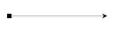

# kendo.dataviz.diagram.Connection

The Connection object is a visual link or connection in the graph or diagram.

## Configuration

### stroke `Object`

Defines the stroke configuration.

### stroke.color `String`

Defines the stroke or line color of the connection.

#### Example - setting the stroke of a Connection

    var s1 = diagram.addShape(new Point(100, 100));
    var s2 = diagram.addShape(new Point(400, 100));
    var conn = diagram.connect(s1,s2, {stroke:"red"});

### hover `Object`

Defines the hover configuration.

### hover.stroke `Object`

Defines the hover stroke configuration.

### hover.stroke.color `String` *(default: "#70CAFF")*

Defines the highlight color when the pointer is hovering over the connection.

#### Example setting color and hovering color of the connection

    var s1 = diagram.addShape(new Point(100, 100));
    var s2 = diagram.addShape(new Point(400, 100));
    var conn = diagram.connect(s1,s2,
            {
                stroke:"red",
                hoveredStroke: "blue"
            });

### startCap `String` *(default: "FilledCircle")*

The start cap (arrow, head or decoration) of the connection:

* "none": no cap
* "ArrowStart": a filled arrow
* "FilledCircle": a filled circle

You easily add custom caps through the underlying mechanism of SVG called 'markers' (see e.g. [the SVG documentation](http://www.w3.org/TR/SVG/painting.html "SVG markers.")).

#### Example - custom connection caps

This defines and adds a custom cap (a small square) to the diagram canvas and is referred to in the connection options.

     var con = diagram.connect(new Point(100,100), new Point(300,100));

     diagram.canvas.addMarker(new kendo.diagram.Marker({
        path: {
            data: "m20,20l0,60l60,0l0,-60z",
            background: "Black"
        },
        id: "custom",
        orientation: "auto",
        width: 15,
        height: 15,
        ref: new Point(50, 50),
        viewBox: new kendo.diagram.Rect(0,0,100,100)
    }));

    con.redraw({startCap: "custom"});

### endCap `String` *(default: "ArrowEnd")*

The start cap (arrow, head or decoration) of the connection:

* "none": no cap
* "ArrowEnd": a filled arrow
* "FilledCircle": a filled circle

Note that you can also use the "ArrowStart" for the endCap but its direction will be inversed. Much like the startCap example above, you can define custom caps (markers) for the endpoint of the connection.

### points `Array`

Sets the intermediate points (in global coordinates) of the connection. It's important to note that currently these points cannot be manipulated in the interface.

#### Example - setting intermediate connection points

    var con = diagram.connect(new Point(100,100), new Point(300,100), {
        points: [
            new Point(150,100),
            new Point(150,150),
            new Point(200,150),
            new Point(200,100)
        ]
    });

### points.x `Number`

Sets the X coordinate of the point.

### points.y `Number`

Sets the Y coordinate of the point.

## Methods

### source

Get/set method which returns the current source of the connection if no parameter is supplied and sets the source if an object is given. This object can be a Point for a floating endpoint (i.e. not attached to a shape), a Shape or a Connector of a Shape. You can use the Shape.getConnector() method to fetch a Connector on the basis of its name. If a Shape is specified the Connection will attach to the "Auto" connector.

#### Parameters

##### source `Shape|Point|Connector`

* Point: any Point on the canvas. This creates an unattached floating endpoint.
* Shape: will bind the endpoint to the"Auto" Connector which will switch between the other connectors to minimize the length of the connection.
* Connector: the connection's endpoint will remain fixed attached to the specified Connector.

If no source is specified the method will return the current object to which the Connection's endpoint is attached.

### sourcePoint

Returns the global coordinate of the connection's start (initial endpoint). The method returns a Point independently of the object to which the source is attached.

### target

Similar to the source, this gets or set the target of the Connection. The parameters and considerations are identical in both cases.

### targetPoint

Similar to the sourcePoint, this gets the coordinates of the target of the Connection independently of its endpoint attachement.

### select

Select or deselects the Connection.

#### Parameters

##### value `Boolean` *(default: true)*

True to select the Connection and 'false' to deselect it.

### bounds

Gets the bounds of the Connection.

### type

Gets or sets the (sub-) type of the Connection which defines the way it routes. The routing of a connection is the way that intermediate points of a Connection defines a route. A route is usually defined on the basis of constraints or behaviors. Currently the framework defines a default polyline route (which simply connects the given intermediate points) and a simple rectangular (aka cascading) route. The cascading type is useful when using tree layout and hierarchies; the routed Connection will in this case enhance the representation of the hierarchy and thus reproduce a classic organization diagram.

#### Parameters

##### value `String` *(default: "Polyline")*

* "Polyline": connects the defined intermediate points. See the points() method.
*  "Cascading": discards given points and defines a cascading path between the endpoints.

### points

### allPoints

Returns all points of the Connection, i.e. the union of the endpoints and the intermediate points.

### serialize

Returns a serialized JSON representation of the Connection.

### redraw

Redraws the Connection with the given options.

##### Example - changing the Connection after it has been added

    var con = diagram.connect(new Point(10,10), new Point(200,70));
    con.redraw({
        content: "Label",
        stroke: {
            color: "orange"
        },
        points:[new Point(200,10)]
    });

### refresh

This refreshes the visuals, the connectors and bounds. The method is part of the object hierarchy, is automatically called when dependencies change and should not be called unless you have customized the Connection.
