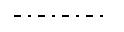
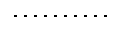
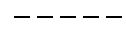
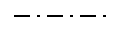
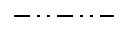
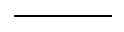

# kendo.dataviz.drawing.StrokeOptions
Shape stroke configuration options.

## Fields

### color `String`
The stroke color.

| Value          | Description
| ---            | --- | ---
| red            | [Basic](http://www.w3.org/TR/css3-color/#html4) or [Extended](http://www.w3.org/TR/css3-color/#svg-color) CSS Color name
| #ff0000        | Hex RGB value
| rgb(255, 0, 0) | RGB value
| transparent    | Entirely transparent fill
| none           | Alias for transparent

### dashType `String` *(default: "solid")*
The stroke dash type.

| Value            |                                              | Description
| ---              | ---                                          | ---
| `dash`           |               | a line consisting of dashes
| `dashDot`        |           | a line consisting of a repeating pattern of dash-dot
| `dot`            |                | a line consisting of dots
| `longDash`       |          | a line consisting of a repeating pattern of long-dash
| `longDashDot`    |      | a line consisting of a repeating pattern of long-dash dot
| `longDashDotDot` |  | a line consisting of a repeating pattern of long-dash dot-dot
| `solid`          |              | a solid line

### opacity `Number`
The stroke opacity. Ranges from 0 (completely transparent) to 1 (completely opaque).

### width `Number`
The stroke width in pixels.
