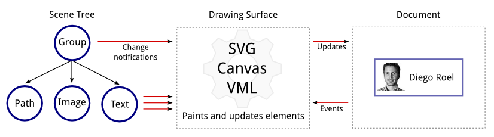

# Overview

The Kendo UI Drawing API is a cross-browser vector graphics library.
It offers a simple scene model similar to the browser Document Object Model.

The scene consists of elements such as Bézier curves, images and groups of elements.
A drawing surface is used to render scenes on and off screen.

Scene elements are "live" and changes of their appearance and geometry are reflected on the screen.

## Design Goals

The Kendo UI Drawing API is designed to serve as a foundation
and extension point for the Kendo UI DataViz widgets.
The Drawing API is also a stand-alone component suitable
for building custom visualizations.

To fulfill these roles the Kendo Drawing API features:
- Seamless support for SVG, Canvas\* and VML
- Batch rendering and live updates
- Off-screen rendering to SVG and image

\* *The Canvas surface currently doesn't fire events*

A heavy focus is placed on performance.
It affects everything from design down to micro optimizations.

## Getting Started

We'll render the scene from the illustration above to get a feel for the Drawing API.

##### Import the Drawing API namespaces
    var d = kendo.dataviz.drawing;
    var g = kendo.dataviz.geometry;

The Drawing API lives in two namespaces:

- `kendo.dataviz.geometry` - Contains primitives such as [Point](/api/dataviz/geometry/point), [Rect](/api/dataviz/geometry/rect) and [Size](/api/dataviz/geometry/size).
- `kendo.dataviz.drawing` - Visual elements, drawing surfaces and helpers.

##### Create the frame
    var path = new d.Path({
            stroke: {
                color: "#6666b3",
                width: 2,
                opacity: 0.6
            }
        })
        .moveTo(0, 0).lineTo(150, 0).lineTo(150, 65).lineTo(0, 65)
        .close();

The [Path](/api/dataviz/drawing/path) element offers
a set of chainable methods for building lines and curves.

Appearance options are passed in as a [configuration](/api/dataviz/drawing/path#configuration) object.

##### Create and position the image
    var imageRect = new g.Rect(
        [5, 5],  // x, y
        [50, 50] // width, height
    );
    var imageUrl = "http://demos.telerik.com/content/dataviz/diagram/people/diego.jpg";
    var image = new d.Image(imageUrl, imageRect);

The image position and size is defined with a [Rect](/api/dataviz/geometry/rect).
The two arrays are shortcuts for `new g.Point(x, y)` and `new g.Size(width, height)`.

##### Create the text
    var text = new d.Text("Diego Roel", [60, 25], {
        font: "bold 15px Arial"
    });

The text is positioned by specifying the location of its top left corner.
Appearance options are passed in as a [configuration](/api/dataviz/drawing/text#configuration) object.

##### Group all the shapes and position them via a transformation
    var group = new d.Group();
    group.append(path, image, text);
    group.transform(
        g.transform().translate(50, 50)
    );

We effectively make the element coordinates relative by translating their parent group.

##### Finally, draw the scene on a surface
    

    

This will create a surface that matches the browser capabilities.
The default will be SVG with fallback to Canvas or VML.

[Complete demo](http://dojo.telerik.com/IsaM)
