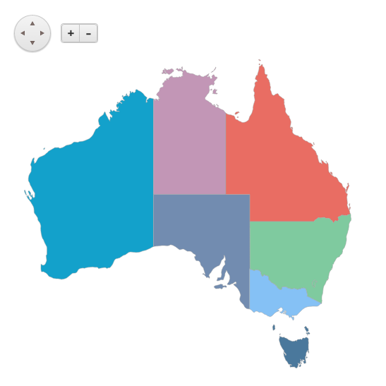
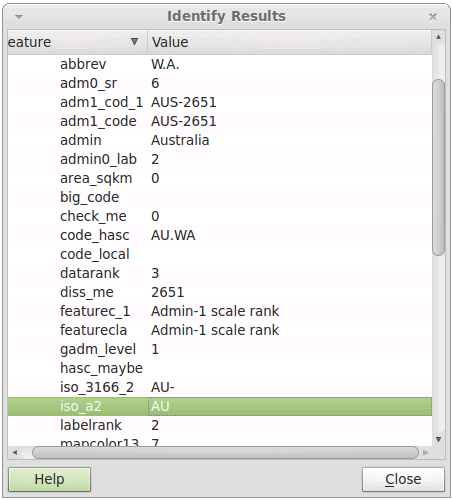
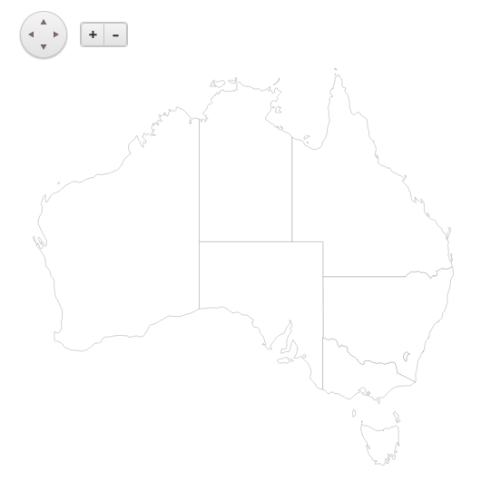

# Authoring Maps

We'll illustrate the process of creating a map from scratch, using freely available datasets.
The goal for this tutorial is a map of the Australian states and mainland territories.
This is how the finished map should look like:

## Finding Data

The first step is obtaining the raw vector data.

For this tutorial we'll use data from the [Natural Earth project](http://www.naturalearthdata.com/).
It offers different data themes in three levels of detail - 1:10m, 1:50m and 1:110m.

Natural Earth datasets are in the public domain. The project is supported by [NACIS](http://nacis.org/).

We'll use the [Admin 1 – States, provinces](http://www.naturalearthdata.com/downloads/50m-cultural-vectors)
data set. A scale of 1:50 000 000 provides good detail/size balance on a country level.

The dataset is available for download in Esri Shapefile format:
[ne_50m_admin_1_states_provinces_lakes.zip](http://www.naturalearthdata.com/http//www.naturalearthdata.com/download/50m/cultural/ne_50m_admin_1_states_provinces_lakes.zip)

> Official authorities are also a good place to look for data. See the [U.S. Census Bureau](http://www.census.gov) and [Ordnance Survey](http://www.ordnancesurvey.co.uk/)

## Exploring Data

A traditional desktop GIS application can be invaluable for exploring new datasets.
The open-source [QGIS](http://www.qgis.org/en/site/) project is an excellent choice in this regard.

We'll start by [importing the Esri Shapefile](http://www.qgis.org/en/docs/user_manual/working_with_vector/supported_data.html#esri-shapefiles) for the data set.
With the help of the [Identify tool](http://www.qgis.org/en/docs/user_manual/introduction/general_tools.html#identify) we can quickly inspect the available metadata.

We can narrow down our interest to features with [ISO A2 country code](http://en.wikipedia.org/wiki/ISO_3166-1_alpha-2) "AU".

## Processing Data

We need to extract the data for the target region and convert it to GeoJSON to make it usable for the Kendo UI Map.

When it comes to converting between different vector formats the first project that comes to mind is the
[OGR Library and utilities](http://www.gdal.org/ogr/index.html), part of the [Geospatial Data Abstraction Library](http://www.gdal.org/).

Included in it is the [ogr2ogr](http://www.gdal.org/ogr2ogr.html) command-line tool.
It's nothing less than a "Swiss Army knife" for vector files.

The following command will convert the dataset to GeoJSON and will filter it out in one go:
    ogr2ogr -f GeoJSON -where "iso_a2 = 'AU'" au-states.json ne_50m_admin_1_states_provinces_lakes.shp

Our dataset is now ready and we can display it.

## Loading Data

Lets set up a simple Kendo UI Map and add a single shape layer to it.
It's GeoJSON data source will point to our processed dataset.

    

    

## Styling

The map can definitely benefit from some color. Let's define a palette and apply it based on province.

    

    

The *provnum_ne* field goes from 1 to 9 denoting each mainland state and territory.
We use the [shapeCreated](/kendo-ui/api/dataviz/map#events-shapeCreated) event to set the fill color of the newly created shape.

This concludes the tutorial.
