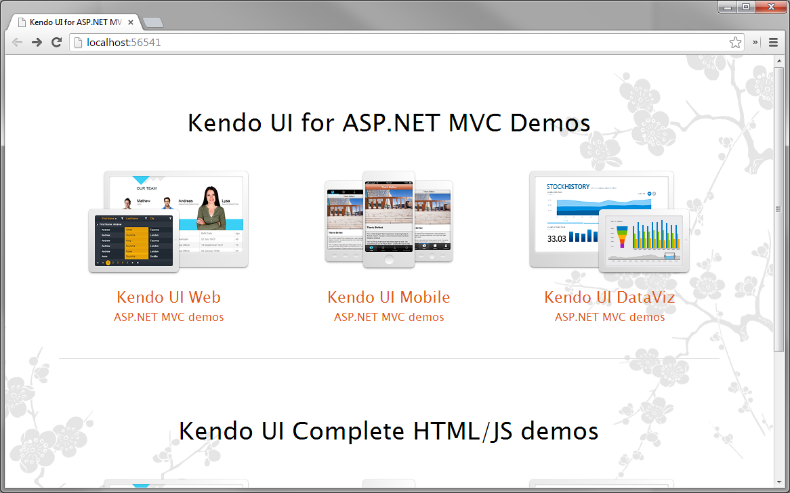

# Telerik UI for ASP.NET MVC
Telerik UI for ASP.NET MVC is a set of server-side wrappers that allow using the Kendo UI widgets from C# or VB.NET code.
This article shows how to download Telerik UI for ASP.NET MVC, install it and then run the sample ASP.NET MVC application.

## Requirements
Telerik UI for ASP.NET MVC requires ASP.NET MVC. It supports ASP.NET MVC  3, 4, and 5.

The sample application requires:

* ASP.NET MVC 4 or ASP.NET MVC 5
* Visual Studio 2012 or Visual Studio 2013
* LocalDB

The Kendo UI Visual Studio Extension supports Visual Studio 2010 and Visual Studio 2012.

## Download

To download Telerik UI for ASP.NET MVC follow these steps.

1. Log in to your [Telerik account](http://www.telerik.com/account.aspx).
2. Click **Products & Subscriptions**  in the top navigation.
3. Click Telerik UI for ASP.NET MVC**. If this option is not available click one of the following: **DevCraft UI Edition**, **DevCraft Complete**  or **DevCraft Ultimate.
4. Click **Download Installer and other resources**.
5. Find the Telerik UI for ASP.NET MVC**  item and click **Download** next to it. This will download the product installer. Alternatively you may click **Browse all product files and download the zip file.

## Installation

Run the Telerik UI for ASP.NET MVC installer. The automatic setup will guide you through the rest of the installation. If you chose to download the zip file - extract it to a location of your preference.

### Install Location

The setup will install Telerik UI for ASP.NET MVC** in **C:\Program Files (x86)\Telerik\Telerik UI for ASP.NET MVC<version>.

### Distribution contents

The Telerik UI for ASP.NET MVC contains the following directories.

* **js** - minified JavaScript files.
* **styles** - minified CSS files and images used by the themes.
* **src** - complete JavaScript, CSS and C# source code. **N/A** in the trial version.
* **wrappers\aspnetmvc\Binaries\MVC3** - assemblies for ASP.NET MVC 3 applications.
* **wrappers\aspnetmvc\Binaries\MVC4**- assemblies for ASP.NET MVC 4 applications.
* **wrappers\aspnetmvc\Binaries\MVC5**- assemblies for ASP.NET MVC 5 applications.
* **wrappers\aspnetmvc\Examples\VS2012**- ASP.NET MVC 4 sample application built with Visual Studio 2012.
* **wrappers\aspnetmvc\Examples\VS2013**- ASP.NET MVC 5 sample application built with Visual Studio 2013.
* **wrappers\aspnetmvc\EditorTemplates**- ready-to-use editor templates based on the Kendo UI widgets.
* **wrappers\aspnetmvc\LegacyThemes** - themes ported from Telerik Extensions for ASP.NET MVC.

## Sample application

Telerik UI for ASP.NET MVC comes with a sample ASP.NET MVC application available in two versions.

* ASP.NET MVC 4 application built with Visual Studio 2012
* ASP.NET MVC 5 application built with Visual Studio 2013

### Running the sample application

To run the sample application follow these steps.

1. Navigate to the installation directory of Telerik UI for ASP.NET MVC.
2. Open the sample Visual Studio Solution
    - to run the ASP.NET MVC 4 version open **wrappers\aspnetmvc\Examples\VS2012\Kendo.Mvc.Examples.sln** with **Visual Studio 2012**.
    - to run the ASP.NET MVC 5 version open **wrappers\aspnetmvc\Examples\VS2013\Kendo.Mvc.Examples.sln** with **Visual Studio 2013**.
3. Press **CTRL+F5** to build and run the application.
4. A browser will load the start page of the sample application. Use the links to explore the available demos.

### Contents

The sample application Visual Studio solution contains the following.

* **Areas/aspx/Views** - WebForm views.
* **Areas/razor/Views**- Razor views.
* **Controllers** - Controller classes.
* **Models** - Model classes.
* **App_Data**- LocalDB sample database.

## Next Steps

After you run the sample application you can continue with the following articles.

* [Fundamentals](/kendo-ui/getting-started/using-kendo-with/aspnet-mvc/fundamentals)
* [Kendo UI in ASP.NET MVC 3 application](/kendo-ui/getting-started/using-kendo-with/aspnet-mvc/asp-net-mvc-3)
* [Kendo UI in ASP.NET MVC 4 application](/kendo-ui/getting-started/using-kendo-with/aspnet-mvc/asp-net-mvc-4)
* [Kendo UI in ASP.NET MVC 5 application](/kendo-ui/getting-started/using-kendo-with/aspnet-mvc/asp-net-mvc-5)
* [Using the Kendo UI Visual Studio Extensions](/kendo-ui/getting-started/using-kendo-with/aspnet-mvc/vs-integration/introduction)
* [Troubleshooting](/kendo-ui/getting-started/using-kendo-with/aspnet-mvc/troubleshooting)
