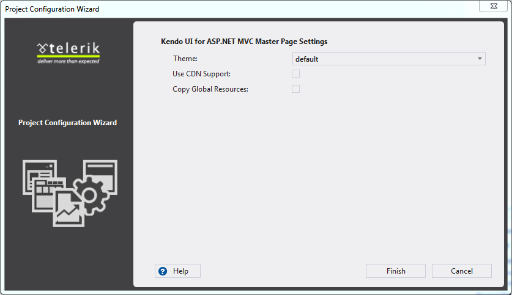

#Configure Project Wizard

This help topic shows how to configure a Telerik UI for ASP.NET MVC Application.

**Visual Studio | Telerik | Telerik UI for ASP.NET MVC | Configure Project** opens the Project Configuration Wizard.

You can modify the following project-wide settings:

- **Theme** - Choose the visual theme for your Telerik UI for ASP.NET MVC Application
- **Use CDN Support** - Enable or disable [CDN](/kendo-ui/getting-started/javascript-dependencies#cdn) support.
- **Copy Global Resources** - Copy the localization files to ~/Scripts/kendo/{version}/cultures
