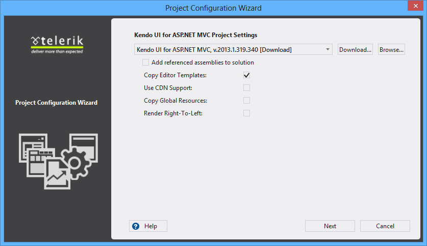
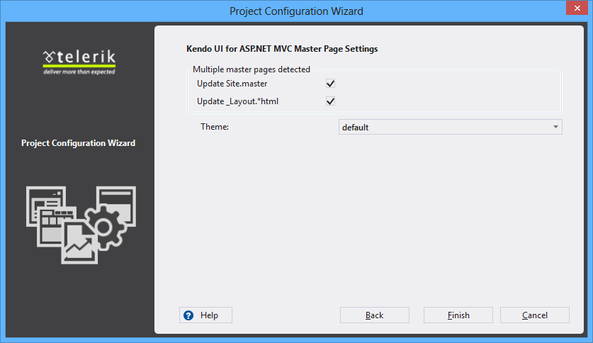
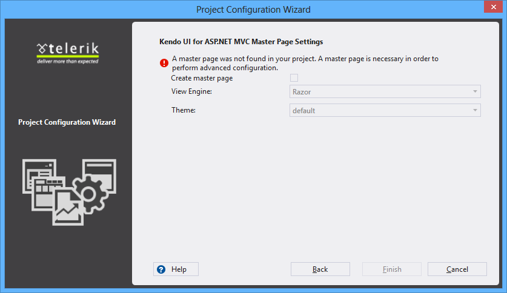

#Convert Project Wizard

This help topic shows how to convert an existing ASP.NET MVC Application to a Kendo UI for ASP.NET MVC Application.

The Convert Project Wizard converts an existing ASP.NET MVC 3 or 4 Application to Kendo UI for ASP.NET MVC Application **(Visual Studio | Telerik | Kendo UI for ASP.NET MVC | Convert to Kendo UI for ASP.NET MVC Application)**. The convert wizard has two steps - project settings page and master pages settings one.

##Project Settings
 

You can modify the following project-wide settings:

- **Version** - Choose which version of Kendo UI for ASP.NET MVC to use
- **Copy Editor Templates** - Copy the predefined editor templates to ~/Views/Shared/EditorTemplates
- **Use CDN Support** - Enable or disable [CDN](http://docs.kendoui.com/getting-started/javascript-dependencies#cdn) support.
- **Copy Global Resources** - Copy the localization files to ~/Scripts/kendo/{version}/cultures 

##Master Page Settings

If you have layout and master page you can choose whether you want to apply the selected settings to both or only one of them:

 
- **Theme** - Choose the visual theme for your Kendo UI for ASP.NET MVC Application
	
In case you have neither a master page nor a layout page you have the opportunity to add one:
 

The wizard gives you the option to create a new master page or layout page so that the user can set the Master Page settings. Depending on the selected view engine the wizard will create master page for WebForms or layout page for Razor.