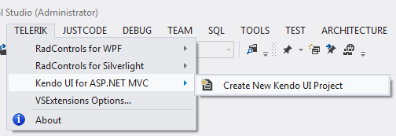
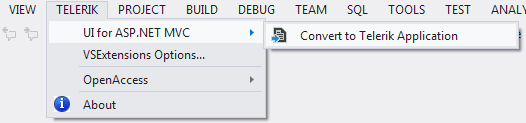
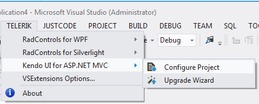
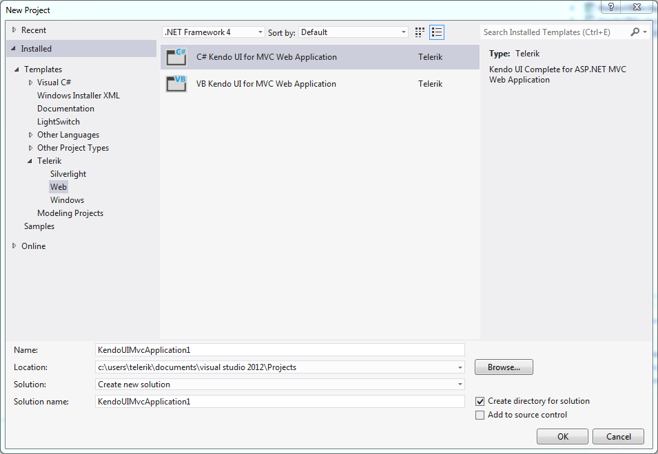
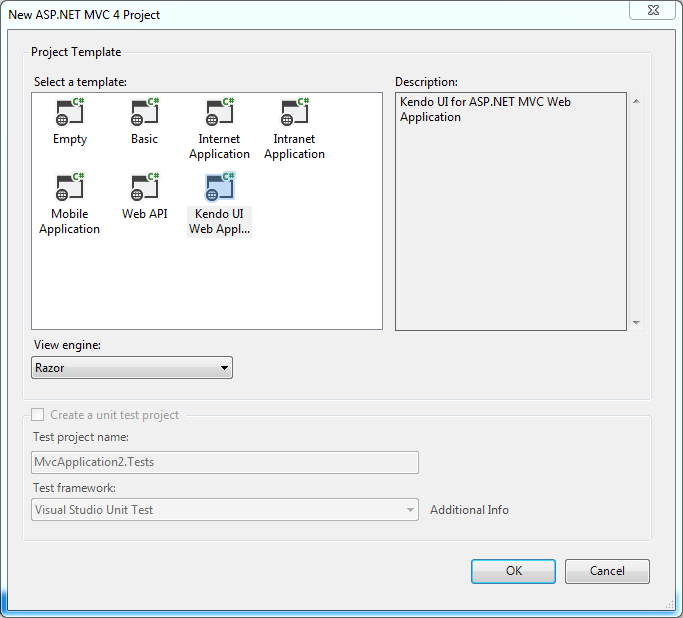

#Introduction

The Kendo UI for ASP.NET MVC Visual Studio Extensions enhance the experience of developing web applications with Kendo UI for ASP.NET MVC. The extensions handle the following major points:

-   **Project Creation and Configuration Wizards** - web asset management, adding the required settings to web.config, changing the theme.
-   **Project Upgrade** - upgrading Kendo UI for ASP.NET MVC to a new version.

The Kendo UI for ASP.NET MVC Visual Studio Extensions are distributed with the Kendo UI for ASP.NET MVC installer. They support Visual Studio 2010 and Visual Studio 2012, handling ASP.NET MVC 3 and ASP.NET MVC 4 applications.

The Visual Studio Extensions can be accessed through the **Telerik | Kendo UI for ASP.NET MVC** menu which has different menu items depending on the selected project in Visual Studio.  Additionally, the extensions can be accessed through the Solution Explorer context menu of any supported ASP.NET MVC Web Application project.

**No selected project in Visual Studio**

 

**Selected project in Visual Studio is Standard ASP.NET MVC 3 or 4 Web Application**

 
 
**Selected project in Visual Studio is Kendo UI for ASP.NET MVC Web Application**

 
 
When installed, the extensions add the following project templates to the New Project dialog of Visual Studio:

 
 
-	C# Kendo UI for ASP.NET MVC Web Application
-	VB Kendo UI for ASP.NET MVC Web Application

These are available in the language specific nodes of the dialog as well:

-	New ASP.NET MVC 3 or 4 Project Wizard also contains Kendo UI for ASP.NET MVC Web Application 

-   The Add New Project dialog contains Kendo UI for ASP.NET MVC Web Application under both CSharp\Web and Visual Basic\Web nodes.

