In this article you will learn how [OpenAccess ORM](http://www.telerik com/products/orm.aspx) can be leveraged on the backend, and [Kendo UI](http://www.telerik.com/kendo-ui) can take care of the UI.

## Getting Set Up

To get started create a new **ASP.Net** **Empty Web Application. **

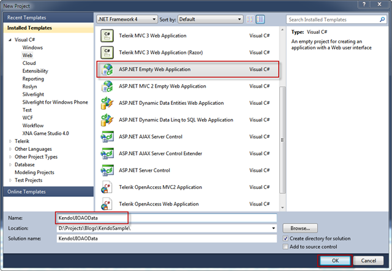

*Note: You can really use any web based project template you like, in this walkthrough you will be starting from scratch.*

Once the project loads, fire up the [NuGet](http://nuget.org/) Package Manager Console.

Add JQuery to the project using the command:

    Install-Package jQuery

Add KendoUI to the project using the command:

    Install-Package KendoUIWeb

Once you run both of these NuGet commands, the solution explorer should look
like this: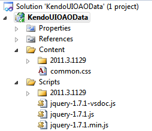

Now we are ready to build the OpenAccess ORM model!

*Note: If you are not familiar with NuGet, or would rather just download, and
add the needed files manually. Kendo UI is available [here](http://www.telerik.com/download/kendo-ui-complete), and Jquery is available [here](http://jquery.com/).*

## Building The Model

To build an OpenAccess ORM data model, right click on the web project,
navigate to **Add** > **New Item**, then select **Telerik OpenAccess Domain
Model**.

*Note: If you do not have OpenAccess ORM installed, you can get the trial
edition [here](http://www.telerik.com/download-trial-file.aspx?pid=638).*

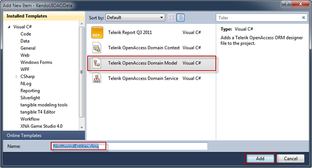

Make sure to give the model a name, and then click **Add**.

In the next window select **Populate from Database**, and click **Next**.

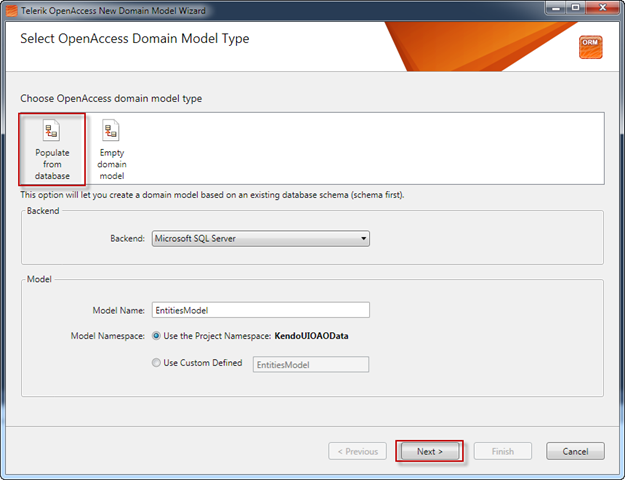

Set up a connection to NorthwindOA, which is installed with OpenAccess, and
then click next.

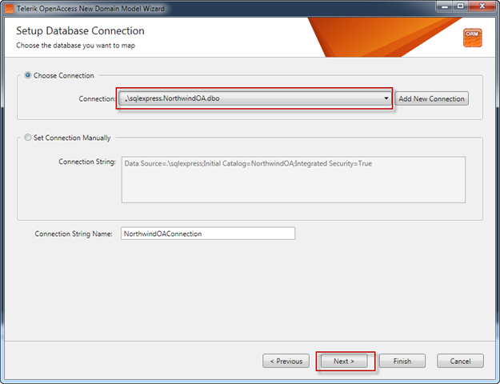

At this point go ahead and include all tables from the database in the data
model.

Click finish, and step 2 is done!  The data model is ready to be used.  The
next step is to expose this data model through a service layer.

## Building The Service Layer

Perform a **build** on the application, and right click on the .rlinq file in the
solution explorer. Select **Generate OpenAccess Domain Model Service…**, and the domain service wizard will fire up.

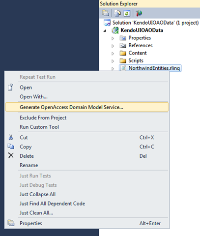

*Note: please ensure you **build** the project before you launch the wizard. If you do not do this, you will not be able to see the domain model in the service wizard as shown below.*

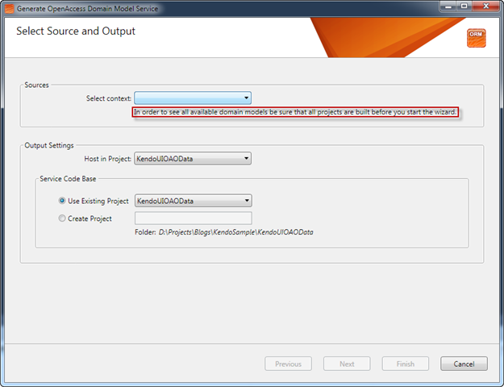

Select the NorthwindOA context in the wizard, and click Next.

This screen allows you to configure the service that will be created.  Give the service a name, select the **WCF Data Services V2 tab**, and then click Finish.

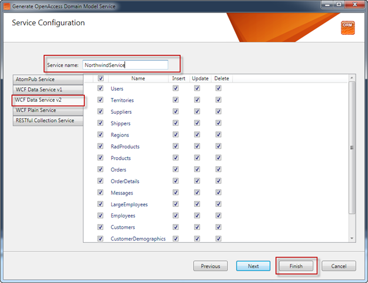

In about 3 clicks you created an OData service which exposes the domain model.

## Connecting the OData Service to a Kendo Grid

Now all that is left to do is configure the front end.  For now we will wire up the Orders to a KendoUI grid, but feel free to take it even further! KendoUI has a lot of cool features to play around with.

First thing we need to do is add a new *html* page to the project. So once again, right click on the project in the solution explorer, select **Add** > **New Item**, only this time choose HTML Page and name the page **default.htm** and then click **Add.**

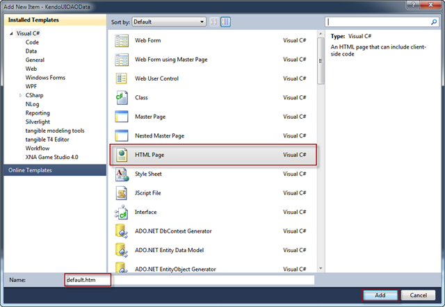

Now we need to add the needed Kendo files, so add the following lines in the head section:

    <link href="Content/common.css" rel="stylesheet"/>
    <link href="Content/2012.3.1114/kendo.common.min.css" rel="stylesheet" />
    <link href="Content/2012.3.1114/kendo.default.min.css" rel="stylesheet"/>
    
    

Next, we need to set up the grid.  KendoUI’s web site provides many [great examples](http://demos.telerik.com/kendo-ui/web/grid/index.html) of how to configure binding; so I won’t go into too much detail here.  The basic idea is that we need a div that will be used as the container for the KendoUI grid, and then we just have to configure the grid in script.

The code needed is here:

    <!--Will be turned into a kendo-ized grid! -->
    

    <!-- configure grid-->
    

Now run the application, and navigate to default.htm.  If all went well you should be presented with a great looking *empty* grid:

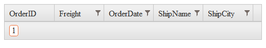

So what gives?!  Why is there no data in the grid?  Well if you take a look at firebug/Chrome/F12 tools you should see something like:

Failed to load resource: the server responded with a status of 400 (Bad
Request)

This error by itself is not very helpful, but if you navigate to the page it tried to retrieve, something like:

    http://localhost:11224/NorthwindService.svc/Orders?$format=json&$inlinecount= allpages&$callback=callback&$top=10

You will be greeted with this error:

The query parameter '$format' begins with a system-reserved '$' character but is not recognized.

## We Need JSON

KendoUI uses JSON to communicate with an OData service; but WCF Data Services does not support JSON *out of the box.*  To enable support for JSON, you can download the needed code from the [Microsoft Code Gallery](http://archive.msdn.microsoft com/DataServicesJSONP).

Once you have added the needed code to the project, and you add the needed reference to **System.Runtime.Serialization.dll**, navigate to NorthwindService.svc.cs (Your name might be different).

In the service add the **JSONPSupportBehavior** attribute:

    [System.ServiceModel.ServiceBehavior(IncludeExceptionDetailInFaults=true)]
    [JSONPSupportBehavior]
    public partial class NorthwindService : OpenAccessDataService<KendoUIOAOData.EntitiesModel>
    {
        //Rest of code omitted for berevity
        .....

Run the application one more time, and this time, you should be greeted by a great looking *populated* grid.

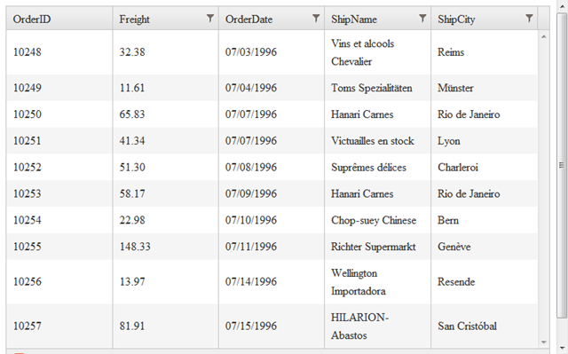

## Conclusions

The OpenAccess ORM Visual Designer and Service Layer Generator make it extremely easy to get started working with KendoUI.  In fact, we only had to write 1 line of server side code thanks to these great tools!

You can see complete code sample in this [gist](https://gist.github.com/1755775).
