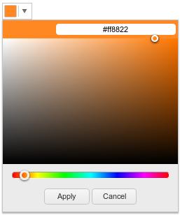
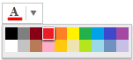

# ColorPicker Overview

The `ColorPicker` is a drop-down widget for selecting colors.  It's
designed to replace a HTML5 `<input type="color">` field, which is not
yet widely supported in browsers, with a user-friendly interface.

## Getting Started

The HTML part:

    <input type="color" id="myColorField" />

To initialize we need to call `kendoColorPicker` on it:

    $(document).ready(function(){
        $("#myColorField").kendoColorPicker();
    });

The original `<input>` element is kept in the DOM, and its `value`
attributed will be updated as the user selects a color, so that
regular `<form>`-s will work.

## Configuration

When calling `kendoColorPicker` you can pass one argument with
configuration options.  The default drop-down is a HSV (hue /
saturation / value) selector and looks like this:

### Get a simple color picker

    $(document).ready(function(){
        $("#myColorField").kendoColorPicker({ palette: "basic" });
    });

Will render a very simple picker containing 20 colors:

### Get the "web-safe" color palette

    $(document).ready(function(){
        $("#myColorField").kendoColorPicker({ palette: "websafe" });
    });

This will display the 216 colors "web-safe" palette that would look
like this:

### Custom colors for the simple picker

You can also get the simple picker to display a custom list of colors,
by just passing them in the `palette` argument, for example:

    $(document).ready(function(){
        $("#myColorField").kendoColorPicker({
            palette: "#fff,#000,#f00"
        });
    });

This would display only white, black and red.  Pass any colors you
want joined with a comma, in either short (3 digits) or long (6
digits) hex notation.  The `#` signs can be missing.

### More options

For more options please see the [API page](../../../api/web/color).
