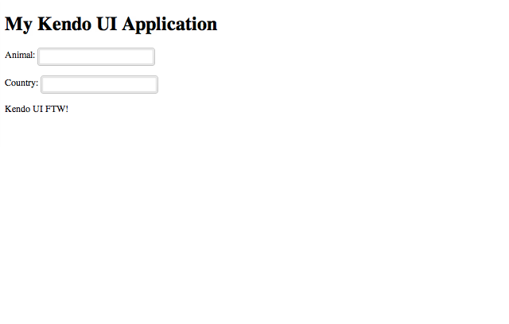

# How-To: Add Widgets with Kendo UI Web

In this how-to, we'll examine how to add widgets to an application or site with [Kendo UI Web](http://www.telerik.com/kendo-ui-web).

Let's begin by examining how to add a widget to an existing page. For this example, let's assume the following Markup:

    <!DOCTYPE html>
    <html lang="en">
    <head>
        <meta charset="utf-8">
        <title>My Kendo UI Application</title>
    </head>
    <body>
        <header>
            <h1>My Kendo UI Application</h1>
        </header>
        <!-- page content goes here -->
        

        

        <footer>
            
Kendo UI FTW!

        </footer>
    </body>
    </html>

The first step is to add script and stylesheet references for jQuery and Kendo UI Web:

    <!DOCTYPE html>
    <html lang="en">
    <head>
        <meta charset="utf-8">
        <title>My Kendo UI Application</title>

        <!-- CDN-based stylesheet references for Kendo UI Web -->
        <link href="http://cdn.kendostatic.com/2013.3.1119/styles/kendo.common.min.css" rel="stylesheet" />
        <link href="http://cdn.kendostatic.com/2013.3.1119/styles/kendo.rtl.min.css" rel="stylesheet" />
        <link href="http://cdn.kendostatic.com/2013.3.1119/styles/kendo.silver.min.css" rel="stylesheet" />

        <!-- CDN-based stylesheet references for Kendo UI DataViz -->
        <link href="http://cdn.kendostatic.com/2013.3.1119/styles/kendo.dataviz.min.css" rel="stylesheet" />
        <link href="http://cdn.kendostatic.com/2013.3.1119/styles/kendo.dataviz.silver.min.css" rel="stylesheet" />

        <!-- CDN-based stylesheet references for Kendo UI Mobile -->
        <link href="http://cdn.kendostatic.com/2013.3.1119/styles/kendo.mobile.all.min.css" rel="stylesheet" />

        <!-- CDN-based script reference for jQuery -->
        

        <!-- CDN-based script reference for Kendo UI -->
        
    </head>
    <body>
        <header>
            <h1>My Kendo UI Application</h1>
        </header>
        <!-- page content goes here -->
        

        

        <footer>
            
Kendo UI FTW!

        </footer>
    </body>
    </html>

> Style and script references to Kendo UI are accessible via HTTPS. However, they are hosted on Amazon CloudFront. Please refer to the [JavaScript Dependencies of Kendo UI](/kendo-ui/getting-started/javascript-dependencies) for more information about script requirements for Kendo UI Web, Kendo UI DataViz, and Kendo UI Mobile.

The next step is to declare a target element for a widget. Depending on the type of widget, this can be represented by a few different elements. Widgets may configured in the following two (2) ways:

* in a script block via a jQuery selector and configuration properties;
* or, with data-* attributes for configuration properties and via a call to kendo.init().

Here's an example for a pair of [AutoComplete](/kendo-ui/api/web/autocomplete) widgets along with some sample data:

    <!DOCTYPE html>
    <html lang="en">
    <head>
        <meta charset="utf-8">
        <title>My Kendo UI Application</title>

        <!-- CDN-based stylesheet references for Kendo UI Web -->
        <link href="http://cdn.kendostatic.com/2013.3.1119/styles/kendo.common.min.css" rel="stylesheet" />
        <link href="http://cdn.kendostatic.com/2013.3.1119/styles/kendo.rtl.min.css" rel="stylesheet" />
        <link href="http://cdn.kendostatic.com/2013.3.1119/styles/kendo.silver.min.css" rel="stylesheet" />

        <!-- CDN-based stylesheet references for Kendo UI DataViz -->
        <link href="http://cdn.kendostatic.com/2013.3.1119/styles/kendo.dataviz.min.css" rel="stylesheet" />
        <link href="http://cdn.kendostatic.com/2013.3.1119/styles/kendo.dataviz.silver.min.css" rel="stylesheet" />

        <!-- CDN-based stylesheet references for Kendo UI Mobile -->
        <link href="http://cdn.kendostatic.com/2013.3.1119/styles/kendo.mobile.all.min.css" rel="stylesheet" />

        <!-- CDN-based script reference for jQuery -->
        

        <!-- CDN-based script reference for Kendo UI -->
        
    </head>
    <body>
        <header>
            <h1>My Kendo UI Application</h1>
        </header>
        <!-- page content goes here -->
        

            <!-- AutoComplete widget; initialized and configured via jQuery selector -->
            
Animal: <input id="animal" />

            <!-- AutoComplete widget; initialized and configured via data-* attributes -->
            
Country: <input id="country" data-role="autocomplete" data-source="countries" />

        

        <footer>
            
Kendo UI FTW!

        </footer>

        
    </body>
    </html>

Here's how the page looks in the browser:

