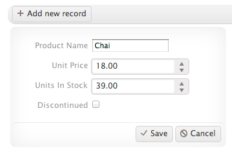

# How-To: Use the ListView of Kendo UI Web

In this how-to, we'll examine how to use the [ListView](http://docs.kendoui.com/api/web/listview) of Kendo UI Web.

The ListView is a widget that was recently introduced in the March 2012 release of Kendo UI Web. Its purpose is to display a custom layout of data-bound items through templates. The ListView is ideally suited for scenarios where you wish to display a list of items in a consistent manner. Examples of its use can be seen in commonplace design structures applied on the Internet today; search engine results, tweets from Twitter, Facebook updates, inbox items in Gmail, card lists in Trello, and so on.

The ListView is designed to put you back in control when it comes to displaying data. In fact, it does not provide a default rendering of data-bound items. Instead, it relies entirely on templates to define how a list of items - including alternating items and items being edited - is displayed.

Let's see how the ListView works by building a simple example that integrates the Twitter API.

First, we'll define a target HTML element such as a list or div:

	

	

Next, we'll initialize the ListView by referring the template and a result set from the Twitter API to be displayed:

	var dataSource = new kendo.data.DataSource({
		transport: {
			read: {
				url: "http://search.twitter.com/search.json",
				contentType: "application/json; charset=utf-8",
				type: "GET",
				dataType: "jsonp",
				data: {
					q: "#KendoUI"
				}
			}
		},
		schema: {
			data: "results",
			total: "results_per_page"
		}
	});

	$("#listView").kendoListView({
		dataSource: dataSource,
		template: kendo.template($("#template").html())
	});

Here's the live example of the representation (above) with additional styling:

<iframe style="width: 700px; height: 450px" src="http://jsfiddle.net/jbristowe/3w7ru/embedded/result" frameborder="0"></iframe>

In scenarios where the number of items bound to a ListView is larger than expected, a Pager will control the items being displayed. Using a Pager is relatively simple. First, you create a target element for its rendering. Typically, it should be placed in the vicinity of the ListView:

	

	

	

The next step is to update the ListView configuration to state that it support paging through its pageable property and to initialize the Pager:

	var dataSource = new kendo.data.DataSource({
		transport: {
			read: {
				url: "http://search.twitter.com/search.json",
				contentType: "application/json; charset=utf-8",
				type: "GET",
				dataType: "jsonp",
				data: {
					q: "#KendoUI"
				}
			}
		},
		schema: {
			data: "results",
			total: "results_per_page"
		}
	});

	$("pager").kendoPager({
		dataSource: dataSource
	});

	$("#listView").kendoListView({
		dataSource: dataSource,
		pageable: true,
		template: kendo.template($("#template").html())
	});

Here's the same live example with a Pager applied to the ListView:

<iframe style="width: 700px; height: 450px" src="http://jsfiddle.net/jbristowe/3w7ru/embedded/result" frameborder="0"></iframe>

From a design perspective, it may be useful to visually differiante each alternating item in a ListView. For example, in the previous example, I may wish to have every second item have a slightly darker background (i.e. banded rows). Defining the altTemplate property accomplishes this through the use of a template that you define. Let's go ahead and update our working example to include a template for alternating items.

	

	

	
	

Here's how the live example how looks with a template for alternating items:

<iframe style="width: 750px; height: 450px" src="http://jsfiddle.net/jbristowe/mBRML/embedded/result" frameborder="0"></iframe>

In addition to paging, the ListView supports item selection, navigation, and inline editing. Supporting these operations is achieved through the initialization of its Boolean configuration options. In the case of inline editing, the ListView provides the editTemplate property, which defines a template for this mode. Once define, the ListView can render out this editing template via the edit method. When invoked, the editTemplate for the ListView is applied against the target item. In most scenarios, you should implement this through an event model that is triggered when the user selected an item to modify.

	var listView = $("#listView").kendoListView({
		template: kendo.template($("#template").html()),
		editTemplate: kendo.template($("#editTemplate").html()),
		altTemplate: kendo.template($("#altTemplate").html())
	});

The ListView encapsulates operations for adding and removing items, item selection, editing, and persisting changes. These methods enable you to modify the underpinning list of items through a series of user-initiated actions/events. In the case of inline editing, the first step is to define a template that is to be used when editing items.

	$(document).ready(function(){
		$("#listView").kendoListView({
			pageable: true,
			selectable: true,
			navigatable: true,
			editable: true
		});
	});

The template you define for the inline editing of items may include other Kendo UI widgets. Looking at the example for editing items on KendoUI.com, you can see that the edit template defines a series of widgets for editing an item:

The inline editing of ListView items is triggered by a click event initiated by a user and is wired up via .delegate() in jQuery.

	var listView = $("#listView").kendoListView({
		dataSource: dataSource,
		template: kendo.template($("#template").html()),
		editTemplate: kendo.template($("#editTemplate").html())
	}).delegate(".k-edit-button", "click", function(e) {
		listView.edit($(this).closest(".product-view"));
		e.preventDefault();
	}).delegate(".k-delete-button", "click", function(e) {
		listView.remove($(this).closest(".product-view"));
		e.preventDefault();
	}).delegate(".k-update-button", "click", function(e) {
		listView.save();
		e.preventDefault();
	}).delegate(".k-cancel-button", "click", function(e) {
		listView.cancel();
		e.preventDefault();
	}).data("kendoListView");

	$(".k-add-button").click(function(e) {
		listView.add();
		e.preventDefault();
	});

Item selection is another scenario supported by the ListView. By setting the selectable property to either "single" or "multiple", you can provide the ability to have users select items.

	$("#listView").kendoListView({
		dataSource: dataSource,
		pageable: true,
		selectable: "multiple",
		template: kendo.template($("#template").html())
	});​

You can capture when items are selected through the change event that is triggered when a user selected one or more items (via shift-select).

	$("#listView").kendoListView({
		change: function(e) {
			var data = dataSource.view();
			var selected = $.map(this.select(), function(item) {
				return data[$(item).index()].ProductName;
			});

			// index selected or read item information through data
		}
	});

Updating the example using the Twitter API that I created before, here's the live representation of that with item selection enabled:

<iframe style="width: 700px; height: 450px" src="http://jsfiddle.net/jbristowe/AtraC/embedded/result" frameborder="0"></iframe>