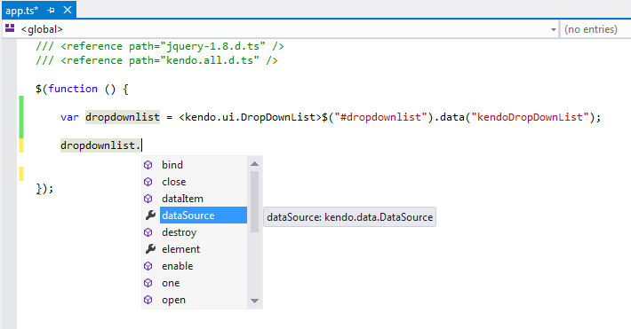
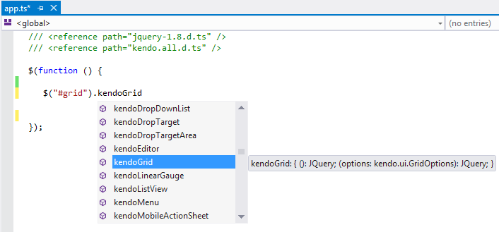
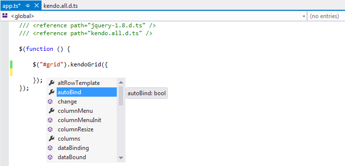
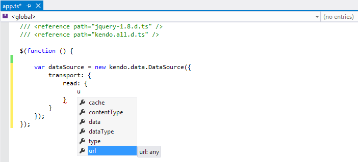

# Kendo UI TypeScript Support

Kendo UI provides a [TypeScript](http://www.typescriptlang.org/) definitions file which enables strongly-typed access to the Kendo UI widgets and their configuration.

## Installation

Each Kendo UI distribution includes a *typescript* directory which contains a `.d.ts` file i.e. `kendo.all.d.ts`. Copy that file in your project.
In your TypeScript file add a reference to that file:

    /// <reference path="kendo.all.d.ts" />

You can optionally include the latest jQuery TypeScript definition file as well:

    /// <reference path="jquery-1.8.d.ts" />
    /// <reference path="kendo.all.d.ts" />

## Features

### Get instance of existing Kendo UI widgets

### Initialize and configure any Kendo UI widget

### Initialize a Kendo DataSource

