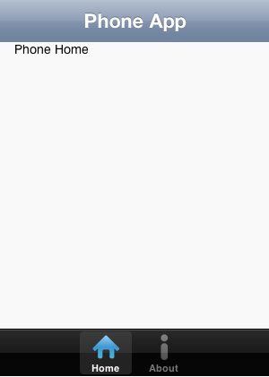
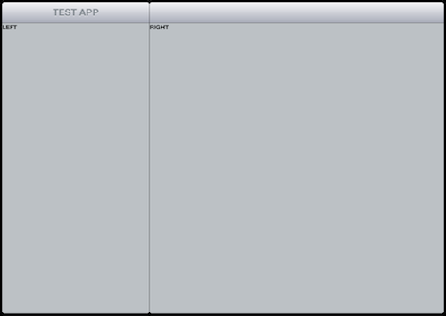
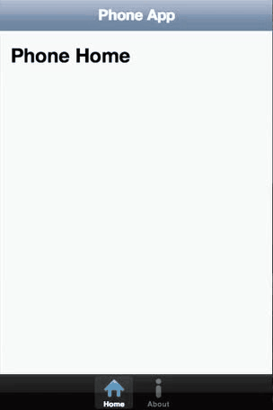

# Universal Mobile Apps with HTML5 & Kendo UI Mobile
At its core, Kendo UI Mobile makes it easy create cross-platform mobile apps using HTML5 and JavaScript. And more than any other framework, Kendo UI Mobile helps your apps automatically adapt to look and feel native on different platforms, like iOS and Android. But did you know that Kendo UI Mobile can also help build apps that look and feel native on different form-factors?

**“Universal” apps allow you to build and deploy a single app that automatically presents phone-specific UI on phones, and tablet-specific UI on tablets.**

The concept is familiar to iOS developers, where Apple introduced universal apps to support iPhone and iPad app development, but the same can be achieved with cross-platform results using HTML, JavaScript, and Kendo UI Mobile. You build one app, with UI for phones and tablets, and deploy to iOS, Android, and Blackberry.

Let’s examine the technique.

##Tablet Specific UI
When building mobile apps to reach phone and tablet users, there are two options for supporting tablets:

1. Deploy a single phone UI that simply scales-up on tablets
2. Deploy an additional tablet-optimized UI that takes advantage of larger tablet screens

The first option is the easiest and least expensive because it only requires one app design. It eliminates the need to work through a second design for an app that is optimized for tablets.

Of course, Option #1 also fails to treat tablets like a unique form factor. More than a bigger screen, tablets have unique UI conventions not found on smartphones, such as the split views common in iPad apps. Developers serious about targeting tablets should aim to deploy apps that are optimized for these unique usability requirements. Building one app with one UI is easy, but it’s not enough to properly target multiple form factors.

**Universal apps simplify the deployment of two distinct app experiences, while simultaneously making it easier for developers to share common app code between phone and tablet app variants** (like common data handling code). When developers take the time to design unique experiences for both form factors, universal apps help put the right experience on the right device.

Fortunately, Kendo UI Mobile provides both tablet and phone specific UI widgets. Developers can leverage these widgets to create a perfectly tailored UI for both form factors, and then apply the following universal technique to easily deploy the results.

##Universal Technique
Building a universal mobile app using Kendo UI Mobile is not automatic, but it is very simple. There are 3 steps involved in the entire process:

1. Build phone AND tablet specific mobile app views using Kendo UI Mobile (remember this is not a one-size-fits-all experience, you need views for both form factors)
2. Use Kendo UI to detect and profile the device using the app (phone or tablet)
3. During app initialization, initialize EITHER the phone OR tablet views in your app

The result allows the same deployed app to look like this on phones:

And like this on tablets:

In code, handling a universal app looks something like this:

####HTML

	

	   <!--Initial tablet mobile app views/splitview go here-->
	

	

	   <!--Initial phone mobile app views/layouts go here-->
	
​

####JAVASCRIPT

	$(function() {
	    var app,
	    //isTablet: Must be mobile OS AND tablet
	    isTablet = kendo.support.mobileOS && kendo.support.mobileOS.tablet,
	    appElement = null,
	    appLayout = null;
	 
	    //Get the correct app HTML container based on tablet status
	    appElement = (isTablet) ? $("#tabletApp") : $("#phoneApp");
	    appLayout = (isTablet) ? null : "phoneDefault";
	 
	    //Initialize the app with the selected container
	    app = new kendo.mobile.Application(appElement, {
	        layout: appLayout,
	        transition: 'slide'
	    });
	 
	    //Adjust visibility of proper app container (used to prevent FOUJUI)
	    appElement.show();
	});​

You can try a live example [using this jsFiddle](http://jsfiddle.net/toddanglin/YGUeJ/5/embedded/result/). To test the behavior you can use Chrome and the built-in Developer Tools to override the browser’s User Agent. Try changing between an iPhone and iPad UserAgent to see how the app initializes differently (refresh the page to see the app reinitialize).

*REMINDER: Kendo UI Mobile only supports Webkit browsers today, so the previous demo will not work in IE or Firefox. Please use a mobile device or Chrome/Safari to view the demo.*

Conceptually, the prior code snippet is doing this:

1. Using the Kendo UI API, which builds a complete profile of a mobile device when an app runs, we determine if the current device is a mobile OS and a tablet.
2. If the device is a tablet, we grab the HTML element containing our initial tablet app view. If it’s not a tablet, we grab the container for our phone app view.
3. Since the tablet view uses a SplitView, we do not need a app layout element. If it’s a phone, we specify our default view layout.
4. Finally, we initialize the Kendo UI Mobile Application using the configured variables.
5. And for a little extra polish, we use some CSS to [avoid FOUJUI](http://blogs.telerik.com/posts/archive/11-10-06/foujui_flash_of_uninitialized_javascript_ui) (more on this in a minute)

**The net effect is a single app containing all of the HTML, CSS, and JavaScript for both tablet and phone users that can be “universally” packaged and deployed via the browser or in hybrid app containers (like PhoneGap).**

##Universal App and FOUJUI
When using the universal app approach, the [“Flash of Uninitialized JavaScript UI”](http://blogs.telerik.com/posts/archive/11-10-06/foujui_flash_of_uninitialized_javascript_ui) (or FOUJUI) can be particularly distracting because the initial HTML page contains markup for both the tablet and mobile views. To provide a polished loading experience and avoid displaying unsightly HTML, it is important to address FOUJUI with some simple CSS and JavaScript.

In the example linked above, this technique is used:

	

	...
	

	

	...
	
​

As you can see, both HTML containers for the tablet and phone views are initially hidden via CSS. As part of the loading process, the correct container is shown after the Kendo UI Mobile application has been initialized:

	appElement.show(); //Where appElement is either the phone or tablet container

You could make the effect even fancier with CSS3 transitions and opacity:

####CSS

	#tabletApp, #phoneApp {
	   opacity:0;
	   -webkit-transition:opacity 2s;
	   transition:opacity 2s;
	}

####JAVASCRIPT

	appElement.show();
	appElement.css(“opacity”,1);

Now the correct app will fade in to view (hardware accelerated by CSS), and the unused views will remain properly hidden. No flash of uninitialized HTML. No ugly plain HTML displayed to users before your app is ready to go.

Without this technique, app loading may look like this, with unitialized HTML visible before the app loads:

With this technique applied, app loading is polished:

##Responsive Design
What about responsive design, you ask?

Responsive design is great for creating mobile sites, but it’s not as useful for creating mobile apps. Responsive design can help you hide, show, resize, and reformat UI for screens of varying size, but it is less suited for presenting completely different modes of usability on different form factors (such as phones and tablets).