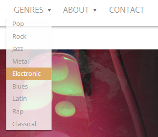
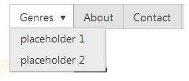

# Creating the Main Menu - Kendo Music Store

The main menu of the Music Store application shows off some of the functionality of the [Kendo Menu Widget][1].
Each of the three menu items shows off something different. The **Genres** item utilizes a pull-down menu of 
items to show all the genres of music in the store. The **About** item displays some static content within a panel
that opens below the menu. The **Contact** item works like a hyperlink or button, and navigates when clicked on,
instead of displaying a sub-menu.

## Add the Main Menu

Let's use the Kendo Menu control to add a navigation menu to the Music Store.
To start, we can define the menu items as a **<ul>** with HTML and Razor:

    <ul id="menu">
        <li>Genres</li>
        <li>About</li>
        <li>@Html.ActionLink("Contact", "Contact", "Home")</li>
    </ul>

Converting this to a Kendo menu is easy. We just add the JavaScript:

    $(document).ready(function () {
        $("#menu").kendoMenu();
    });

This uses a jQuery selector to get our **<ul>** tag with the id "menu," and turns it into a Kendo UI menu.
This type of kendo usage is sometimes called "explicit" widget initialization, since the element is directly
targeted in JavaScript (We will see examples of implicit initialization, **data-** attributes and the MVVM
pattern later on, but for our first control, let's keep it simple.)

## Add the Genres pull-down menu

Next we can move the Genres list into a pull-down menu. Any **<li>** elements that in turn contain another
list **<ul>** element are treated as a pull-down item. Let’s start with an empty pull-down menu item for our Genres:

    <li>Genres
        <ul>
            <li>placeholder 1</li>
            <li>placeholder 2</li>
        </ul>
    </li>

This creates the pull-down item:

We can replace our "placeholder" **<li>** elements with an MVC partial that loads the list of Genres:

    <li>Genres
        <ul>
            @{Html.RenderAction("GenreMenu", "Store");}
        </ul>
    </li>

This partial outputs a list of **<li>** elements that work as links to each Genre:

    @model IEnumerable<MvcMusicStore.Models.Genre>

    <ul>
        @foreach (var genre in Model)
        {
            <li>@Html.ActionLink(genre.Name,
                    "Browse", "Store",
                    new { Genre = genre.Name }, null)
            </li>
        }
    </ul>

## Add the About pull-down menu

Another ability of the Kendo Menu control is adding any content into a drop-down menu item.
It does not have to be a list of selectable items, like the Genres.
To add content to a menu item, Include a **<ul>** element, with a single **<li>** element.
Within that element, use a **
** to specify the content.
For example, let's add this content for out "About" menu item:

    <li>About
        <ul>
            <li>
                

                    
                    
Try Kendo UI yourself in the interactive Kendo UI Dojo!

                    
<a href="http://www.kendoui.com/dojo.aspx" target="_blank">Launch Kendo UI Dojo</a>

                

            </li>
        </ul>
    </li>

This creates the **
** content displayed in a drop-down menu item:

    [1]: http://demos.kendoui.com/web/menu/index.html