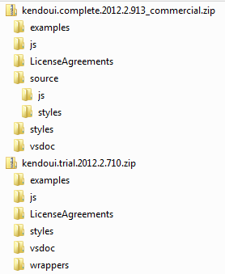
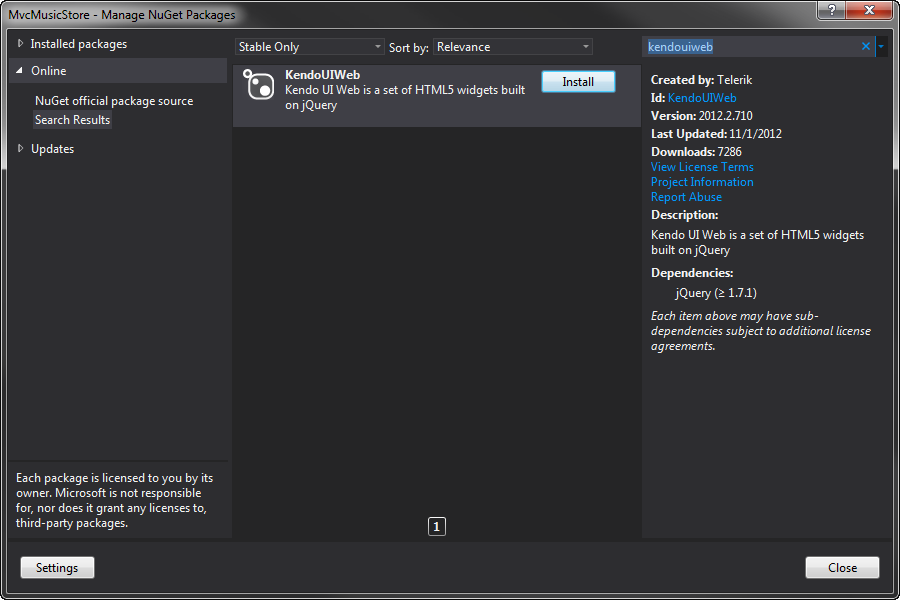

# Project Setup - Kendo Music Store

## Adding Kendo UI to the project

Start by adding Kendo UI to the project. There are a lot of ways to accomplish this.
Kendo UI cna be downloaded from [kendoui.com](http://www.kendoui.com/download), referenced from the CDN, or fetched
using NuGet.

### Downloading Kendo UI

KendoUI is divided into three parts: Web, Mobile, and DataViz.
The preferred method of getting KendoUI is to browse to [kendoui.com][1] and download Kendo UI as a .zip file.
Depending on whether you are using the Trial version, or have purchased the full Commercial version,
you will have a .zip file that follows one of these directory structures:

The **\js** and **\styles** folders in the root of the .zip file contain the "minified"
versions of the KendoUI .js and .css files.
If you have the commercial version of Kendo UI, you may also notice the **\source** folder.
This folder also contains \js and \styles folders, but these are the full, non-minified versions
of the .js and .css.
These would typically be used for local development and debugging, but the minified versions
are the ones that should be deployed in a real application.
For that reason, we will use the minified files in the remainder of this example project.

### Fetching from the CDN

Kendo UI Web can also be fetched from a CDN instead of downloading the files. For more
information and the CDN URLs, please see: **[Getting Started: Javascript Dependencies](http://docs.kendoui.com/getting-started/javascript-dependencies)**

### Fetching from NuGet

Kendo UI Web is also avaiable using the NuGet package manager in Visual Studio. Simply search for 'kendo'.

### More Information

In the Music Store project, we referenced the **kendo.all.min.js** file and the **Default**
Kendo theme, because we were going to be using a good number of the Kendo UI Widgets,
and also using DataViz. If we were only going to be using a few select portions of Kendo,
we would have taken individual JavaScript files and make a seperate bundle for them, reducing
the download size for the end user.

> For more information on this topic, see: **[Getting Started: Downloading Kendo](http://docs.kendoui.com/getting-started/downloading-kendo)**

## Create MVC Bundles

ASP.NET MVC 4 has the ability to bundle and minify JavaScript and Style Sheets. In the Music Store
project, we are not bundling the Kendo UI .js and .css files. This is because we are using
**kendo.all.min.js** which is already pre bundled and minified.

Also, it is important to note that in **Debug** mode, by default the bundler will not include minified files.
This means that if we made a bundle of the Kendo UI .css files:

    bundles.Add(new StyleBundle("~/Content/kendo").Include(
        "~/Content/kendo.common.min.css",
        "~/Content/kendo.default.min.css"));

These files would not be included when running in Debug mode, only in Release mode.
You can see, and modify, which files the ASP.NET bundler will ignore by inspecting
the **bundles.IgnoreList** collection at runtime. For example:

    // Clear all items from the default ignore list to allow minified CSS and JavaScript files to be included in debug mode
    bundles.IgnoreList.Clear();
    
    // Do not include intellisense files
    bundles.IgnoreList.Ignore("*.intellisense.js");

### Seperating Libs and App code into bundles

Most sizable web applications will incluse a number of .js files. It is a good practice to seperate these into
bundles for third-party libraries, and your own application code.

In the Music Store application, the only third-party library we are using (aside from kendo) is Date.js.
We set up a **libs** bundle for this third-party library, plus an **app** bundle for our own application code.

    bundles.Add(new ScriptBundle("~/bundles/libs").Include(
        "~/Scripts/date.js"));

    bundles.Add(new ScriptBundle("~/bundles/app").Include(
        "~/Scripts/App/kendo-custom-bindings.js",
        "~/Scripts/App/kendo-cart-menu-widget.js",
        "~/Scripts/App/config.js",
        "~/Scripts/App/cart.js",
        "~/Scripts/App/store.js",
        "~/Scripts/App/shared-layout.js"));

And render them in **_Layout.cshtml**:

    @Scripts.Render("~/bundles/libs")
    @Scripts.Render("~/bundles/app")

### Easing debugging with the commercial version of Kendo

While it is typically good practice to always include the minified versions of .js and .css files that you use,
it makes it more difficult when trying to debug JavaScript errors. The commercial version of Kendo UI comes with the
full non-minified source code. We can include these files instead, then use the ASP.NET bundler to bundle and minify them
for production, while keeping them un-minified for development.

To do this, include the non-minified .js and .css files from the **\source** folder of the downloaded Kendo UI .zip file in your project.
Then configure the ASP.NET bundles to include these files. For example:

    bundles.Add(new ScriptBundle("~/bundles/kendo").Include(
        "~/Scripts/kendo.all.js"));

    bundles.Add(new StyleBundle("~/Content/kendo").Include(
        "~/Content/kendo.common.css",
        "~/Content/kendo.default.css"));

Then set up your **web.config** file to enable bundling only for **Release** builds of the application.
This way, ASP.NET will server the non-minified files for Debug, and a bundled minified version for Release.
To do this, in the **Debug** version of your **web.config** file, set compilation debug to true:

    <system.web>
      <compilation debug="true" targetFramework="4.5" />

The **Release** version of the **web.config** file would set debug to false:

    <system.web>
      <compilation debug="false" targetFramework="4.5" />

## Adding Kendo to the ASP.NET Layout Page

We can now add Kendo, and any other third-party libraries we are going to use, to the pages.
The Music Store uses the **Views\Shared\_Layout.cshtml** master page, so we will add Kendo here.
We need to make sure that Kendo’s JavaScript files come after jQuery. For styling, we include
**kendo.common.min.css**, plus one of the Kendo UI Themes. In this example we are using
**kendo.default.min.css**, which is the Default theme.

    <head>
        <meta charset="utf-8" />
        <title>@ViewBag.Title - Kendo UI Music Store</title>
        <link href="~/favicon.ico" rel="shortcut icon" type="image/x-icon" />
        <meta name="viewport" content="width=device-width" />
        <link href="~/Content/kendo.common.min.css" rel="stylesheet" /> // <-- Added Here.
        <link href="~/Content/kendo.default.min.css" rel="stylesheet" /> // <-- Added Here.
        @Styles.Render("~/Content/css")
        @Scripts.Render("~/bundles/modernizr")
    </head>
    <body>
        // ...
        
        @Scripts.Render("~/bundles/jquery")
         // <-- Added Here.
        @RenderSection("scripts", required: false)
    </body>

Typical practice is to include as much JavaScript at the bottom of the **&lt;body&gt;** element as possible.
In the Music Store project, we are actually including jQuery in the **&lt;head&gt;**. This will be discussed
later in the tutorial, but it is because we later use some of the [Kendo UI ASP.NET MVC Helpers](http://docs.kendoui.com/getting-started/using-kendo-with/aspnet-mvc/introduction#using-kendo-ui-in-aspnet-mvc-4-application)
which inserts **&lt;script&gt;** tags into the **&lt;body&gt;** of the page, and require that jQuery already be defined.
