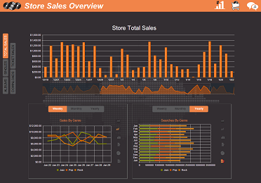

# Tutorial: Kendo Music Store: Introduction

In this tutorial, we will review portions of the **Kendo Music Store** sample project.

The Music Store sample is split into three seperate projects; Web, Dashboard and Mobile.

# Kendo Music Store Web

This sample project was based on Microsoft's [MVC Music Store](http://mvcmusicstore.codeplex.com/), so much of the
server-side processing and the data structure are reused in this project.
The UI of the music store was completely redesigned with Kendo UI.
It focuses on [Kendo UI Web](http://www.kendoui.com/web.aspx), how it was used and the ways in which it interacts with ASP.NET MVC, WebAPI and WCF Data Services.

## View the Live Site

The live Kendo Music Store site is located at [demos.kendoui.com/musicstore](http://demos.kendoui.com/musicstore).

## Get the Source Code

Start by getting the source code for the [Kendo Music Store from GitHub](https://www.github.com/telerik/kendo-music-store).
The project is for use with Microsoft Visual Studio 2012, and requires MVC 4 and NuGet.

## Explore the Tutorial

Please use the navigation tree at the left to navigate the sections of this tutorial.

# Kendo Music Store Dashboard

The Dashboard builds upon the music store theme, adding a conceptual management dashboard to track album performance.
It focuses on [Kendo UI DataViz](http://www.kendoui.com/dataviz.aspx) and how Kendo and Sammy.js were used to create a visually rich single page application.

## View the Live Site

The live Kendo Music Store Dashboard is located at [demos.kendoui.com/musicstoredashboard](http://demos.kendoui.com/musicstoredashboard).

## Get the Source Code

Start by getting the source code for the [Kendo Music Store Dashboard from GitHub](https://www.github.com/telerik/kendo-music-store-dashboard).
The project is for use with Microsoft Visual Studio 2012, and requires MVC 4 and NuGet.

## Explore the Tutorial

Please use the navigation tree at the left to navigate the sections of this tutorial.

# Kendo Mobile Music Store

The mobile music store presents a consumer-focused mobile version of the web Music Store.
This sample project was built using [Telerik Icenium](http://www.icenium.com/) and interacts
with the [Kendo Music Store](http://demos.kendoui.com/musicstore) sample project's web services.

## Get the Source Code

Start by getting the source code for the [Kendo Mobile Music Store from GitHub](https://www.github.com/telerik/kendo-mobile-music-store).
This project is designed to be cloned into Icenium Graphite.
If you are not an Icenium customer you may clone the repository to your local drive and browse it with your favorite text editor.

## Explore the Tutorial

Please use the tree navigation at the left to navigate the sections of this tutorial. The Mobile Music Store pages are listed under "Tutorials\Mobile".