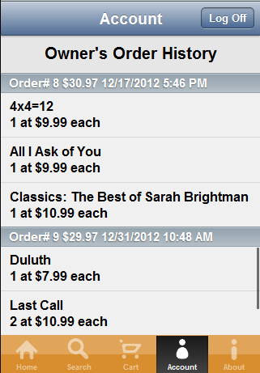

# Tutorial: Kendo Mobile Music Store: Account View

The Account View gives the user a place to log ina nd out as well as display their order history.

## Login Credentials

The method of login demonstrated in the Mobile Music Store application is just one possibility of many ways to handle login.
A better approach could have been to present the user with the login screen the first time they open the app then persist the credentials in localStorage,
or use an OAuth service to log in through Facebook or Twitter.
Since this app needed to integrate with the existing [Kendo Music Store](http://www.kendouimusicstore.com) site that used ASP.NET Forms Authentication a less than ideal approach was taken in this mobile app.
We suggest researching all possible login options and selecting the one that best fits your needs.

## Order History

Order history for the user is presented as a grouped ListView with a custom header template.
Each time the account view is shown the `accountViewShow()` function is called.

    accountViewShow: function (showEvt) {
        var element = $("#order-history-list");
        var existingList = element.data().kendoMobileListView;
        if(existingList) {
            existingList.destroy();
        }
        element.kendoMobileListView({
            dataSource: data.orderHistory(account.userName, account.password),
            scrolling: "endless",
            template: kendo.template($("#order-history-template").text()),
            headerTemplate: kendo.template($("#order-history-header-template").text())
        });
    }

This function starts by destroying any existing order history ListView widget.
The widget is then recreated and the data is retrieved for the current user by calling `data.orderHistory(account.userName, account.password);`

    orderHistory: function (user, pass) {
        return new kendo.data.DataSource({
            serverPaging: true,
            serverSorting: true,
            pageSize: 5,
            sort: [{field: "OrderDate", dir: "desc"}, {field: "Title", dir: "asc"}],
            group: {field: "OrderId"},
            transport: {
                read: {
                    url: config.orderHistoryUrl,
                    type: "POST",
                    data: {
                        username: user,
                        password: pass
                    }
                }
            },
            schema: {
                data: "Data",
                total: "Total",
                model: {
                    id: "OrderId",
                    fields: {
                        OrderId: { type: "number" },
                        OrderDate: { type: "date" },
                        Quantity: { type: "number" },
                        UnitPrice: { type: "number" },
                        Title: { type: "string"}
                    }
                }
            },
            requestStart: function () { if (this.page() === 1) { utils.showLoading(); }},
            requestEnd: function () { if (this.page() === 1) { utils.hideLoading(); }},
            error: function () { utils.hideLoading(); utils.showError("There was an error loading the data from the server. Please close the app and try again."); }
        });
    }

The `data.orderHistory()` function creates a new DataSource that uses the `group` property to group orders by their `OrderId`.

The header for each order history group is controlled by the template:

    

This template prints the order number, the date of the order, and calls `app.accountView.calcOrderTotal()` to get the total price for the order.
Note that in the context of this template, `data.items` is an array that countains all the data items that belong to this grouping.
