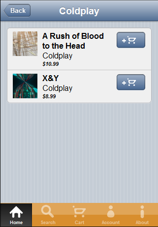

# Tutorial: Kendo Mobile Music Store: Albums View

Both the `artists-view` and `genres-view` pages both navigate to the `albums-view` when an item is selected.
The Albums View displays a list of albums in a ListView widget and applies whatever filtering was passed to it by the previous view.

The HTML for the albums view is slightly different from the genres or artists views in that it contains a `header` element.
This was done because we could reuse the `base-layout` and just add the header with the appropriate title and back button.

    

        <header data-role="header">
            

                <a class="nav-button" data-align="left" data-role="backbutton">Back</a>
                
            

        </header>

        <ul data-role="listview" data-bind="source: albums, events: {lastPageReached: lastPageReached}" data-auto-bind="false" data-template="album-list-template" data-style="inset" data-endless-scroll="true"></ul>
    

## Setting the Data Filter

The attribute `data-show="app.albumsView.show"` tells Kendo that we want to call this function each time the view is shown.
The show function does several things:

    show: function (e) {
        var filter = utils.parseQueryStringToObject();
        utils.setViewTitle(e.sender.element, filter.title);
        utils.scrollViewToTop(e.sender.element);

        data.clear(data.albumsList);
        data.albumsList.filter(filter);

        _createAlbumsListView();
    }

It starts by calling `utils.parseQueryStringToObject()` to get an object that contains properties that match the parameters passed to the view.
It then gets the `title` that was passed to the view and sets the view's title to match. This was done because we wanted to have the name selected on the previous view (genre or artist) to carry over to this view.
Next it resets the scroll position of this view back to the top. This is important because the view is reused each time a genre or artist is selected.
If a genre with hundreds of albums had been selected and the user scrolled down on the page, then an artist was selected that only had one album, the view would normally stay scrolled down even though the data no longer fills the view.
The user would have been left seeign a potentially blank page and would have had to scroll back up to find the data.
Next the current data is cleared and a new filter applied. This will cause a new set of data to be loaded from the server because the underlying DataSource has `serverFiltering` enabled.

## Working around a limitation with ListView's endless scrolling

The final action that `show()` performs is to create the `ListView` widget by calling `_createAlbumsListView();`
This function is defined as:

    var _createAlbumsListView = function () {
        var listViewElement = $("#albums-listview");
        var existingListView = listViewElement.data().kendoMobileListView;
        var viewModel = kendo.observable($.extend({
            albums: data.albumsList
        }, albums.baseAlbumViewModel));

        if(existingListView) {
            existingListView.destroy();
        }

        kendo.bind(listViewElement, viewModel, kendo.mobile.ui);
    };

The intent here is to avoid a limitation with the ListView widget's "endless scrolling" feature.
With endless scrolling enabled the widget will keep loading more pages of data untill it reaaches the end.
When this happens, the widget detatches itself from the scroll events so that scrolling to the bottom the next time will no longer query the server for more pages of data since the end was already reached.
Unfortunately the ListView widget does not detect the filter change on the DataSource and reattach itself and reset endless scrolling.
Instead, if we were to reuse the same ListView widget instance and just change the filter on the underlying DataSource, the ListView would only load the first page of data since it stopped watching for endless scrolling.
Because of this limitation, the `_createAlbumsListView()` function sees if a ListView widget already exists and calls `destroy()` on it.
It then creates a new ListView widget instance and binds it to a viewModel.
This new ListView instance will work with endless scrolling again.

## Showing Cart Quantity in Add To Cart buttons

Each album in the albums view has an "add to cart" button.
If this button is tapped the album will be added to the cart with a quantity of 1.
Each time the button is tapped after that the quantity is increased by 1.
The current quantity int he cart for the album is shown on the button.
This was done using an MVVM binding that is bound to the shopping cart.

Each "Add to Cart" button is defined in the template for an album as:

    

        
        
    

The text that is set to the quantity in the cart is represented by the first `span` element, which is bound to `data-bind="text: qtyInCart"`.
This property is defined in the view model as a function:

    qtyInCart: function (album) {
        var cartItem = cart.find(album.get("AlbumId"));
        if(cartItem) {
            return cartItem.get("qty");
        } else {
            return "";
        }
    }

The album is first found in the cart, then `.get("qty")` is called to bind the element to the cart item's quantity.
Now when the quantity is changed on the cart item, the "Add to Cart" button will automatically be updated by the MVVM binding.
