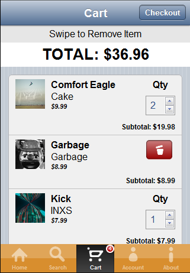

# Tutorial: Kendo Mobile Music Store: Cart View

The cart view displays all items that have been added to the cart and allows users to edit quantities nad remove items from the cart.

The main portion of the cart is a basic ListView widget that displays the items contained in the cart DataSource.

    <ul data-role="listview" data-bind="source: items" data-template="cart-list-template" data-style="inset"></ul>

## Maintaining Cart Items

The code for the shopping cart is in `scripts/cart.js`.
The shopping cart is maintained by a DataSource that is held in memory and starts as an empty array.
Each cart item consists of a field to hold the current quantity, a deleteMode boolean, and the album data itself.

    var cartItems = new kendo.data.DataSource({
        data: [],
        schema: {
            model: {
                fields: {
                    qty: { type: "number", min: 1, max: 99 },
                    deleteMode: { type: "boolean" },
                    album: {}
                }
            }
        }
    });

An `addAlbum()` function was provided to the rest of the application as a single way to add albums to the cart.
If the same item is added to the cart more than once the addAlbum function will detect this and incrament its quantity instead of adding a duplicate item to the cart.

    var addAlbum = function (album) {
        var existing = findAlbum(album.AlbumId);
        if(existing) {
            existing.set("qty", existing.qty + 1);
        } else {
            cartItems.add({ album: $.extend(true, {}, album), qty: 1, deleteMode: false });
        }
    };

An important thing to note in the addAlbum function is the use of the jQuery `extend` function when setting the album of the cart item; `album: $.extend(true, {}, album)`
This is being used to create a clone of the album that is being added to the cart.
We do not want to have the same album instance added to the cart or else the same album instance would be contained in two different Observable arrays (the albums DataSource and the cart DataSource).
This would cause MVVM binding issues because the album instance would become detached from its original DataSource and bindings will stop updating.
It is important to clone the object if you want to add it to a second DataSource.

## Updating the Total When Quantity Changes

The total price for all items in the cart is displayed at the top of the view.
Since we did not want the total to scroll off the top when the list of items in the cart is scrolled, the total was placed in the header.

    <header data-role="header" class="cart-header">
        ...
        <h1>TOTAL: </h1>
    </header>

An MVVM binding was used to bind to the `cart.aggregates.formattedTotal()` function.

    var cartAggregates = kendo.observable({
        total: 0,
        formattedTotal: function () {
            return kendo.toString(this.get("total"), "c");
        }
    });

The `formattedTotal` function uses the observable `get("total")` function so that the total becomes bound to the `cartAggregates.total` field and will be updated when the total changes.
The DataSource change event is then used to watch for changes to the cart and update the `cartAggregates.total` field.

    var cartItems = new kendo.data.DataSource({
            change: function () {
                var totalPrice = ...;
                cartAggregates.set("total", totalPrice);
            },

## Removing Cart Items

Cart items can be removed by swiping left or right or by pressing and holding on an item.
Performing wither of these actions will toggle a "delete mode" on the item.
When in delete mode the item's quantity input box will be hidden and a delete button will appear in its place.

The swipe and hold events were captured by placing a [Touch](http://demos.kendoui.com/mobile/touch/index.html) widget as the main element of each cart item.

    

        ...
    

The Touch widget's `swipe` and `hold` events were then bound with data attributes to the `onToggleDeleteMode()` function.
This function gets the selected cart item by its uid and toggles the value of the "deleteMode" field on the cart item.

    onToggleDeleteMode = function (evt) {
        var element = evt.sender.element;
        var li = element.parents("li");
        var uid = li.data("uid");
        var cartItem = cart.items.getByUid(uid);

        cartItem.set("deleteMode", !cartItem.deleteMode);
    }

The visibility of the Quantity input and Delete button are controlled by `visible` and `invisible` MVVM bindings to the `deleteMode` of the cart item.

    <strong data-bind="invisible: deleteMode">Qty</strong>
    <input type="number" data-bind="value: qty, invisible: deleteMode" min="1" max="99" />
    

When the delete button is clicked the `onRemove()` function is called.
This function again finds the cart item by its uid and removes it from the DataSource.
A fade-out animation is also used for better visual feedback to the user.

    var onRemove = function (clickEvt) {
        var element = clickEvt.sender.element;
        var li = element.parents("li");
        var uid = li.data("uid");

        var animation = {
            "opacity": 0
        };

        li.animate(animation,
            300,
            function () {
                cart.items.remove(cart.items.getByUid(uid));
                _scrollToTopIfTooFewItemsInCart();
            });
    }

An additional action that needed to be performed was to see if the new shortened list left the number of items in the cart too few to cause scrolling.
If only 1 or 2 items are in the cart, then there is not enough content to fill the scroll panel, and scrolling disables itself.
However there was a situation where the cart list was scrolled down slightly and then an item was removed from the cart.
After the item was removed, it may have caused the content to become too few to scroll,a nd the scroll view would disable itself.
However, the view was still scrolled down slightly, and now the user had no way to scroll back to the top of the cart and see the first item.
To work around this issue, we check to see if the cart content is now shorter than the scroll view. If it is, then the scroll view is reset back to the top.
This is done in the `_scrollToTopIfTooFewItemsInCart()` function.

    var _scrollToTopIfTooFewItemsInCart = function () {
        if(_view.scrollerContent.height() < _view.scroller.element.height()) {
            utils.scrollViewToTop(_view.element);
        }
    };
 
