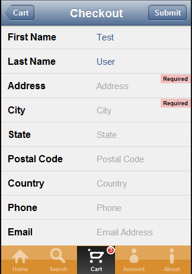

# Tutorial: Kendo Mobile Music Store: Checkout View

In a normal real-world application this step would usualy be part of the on-boarding or initial registration process instead of making the user enter shipping information to checkout.
However, we include it at this step to demonstrate laying out a data entry "form" with some basic field validation in Kendo Mobile.

## Data Entry Form Layout

With the default Kendo Mobile styling, a data entry form can be constructed with labels on the left half of the screen, and entry boxes on the right half by simply creating a ListView of &lt;li&gt; elements.
Each of these elements should contain the text for the label, and a single &lt;input&gt; element.

        <ul data-role="listview">
            <li>
                First Name
                <input type="text" name="firstName" placeholder="First Name" data-bind="value: firstName" pattern=".{0,160}" required validationmessage="Required" />
            </li>
            <li>
                Last Name
                <input type="text" name="lastName" placeholder="Last Name" data-bind="value: lastName" pattern=".{0,160}" required validationmessage="Required" />
            </li>
            <li>
                Address
                <input type="text" name="address" placeholder="Address" data-bind="value: address" pattern=".{3,70}" required validationmessage="Required" />
            </li>
            <li>
                City
                <input type="text" name="city" placeholder="City" data-bind="value: city" pattern=".{0,40}" required validationmessage="Required"/>
            </li>
            <li>
                State
                <input type="text" name="state" placeholder="State" data-bind="value: state" pattern=".{0,40}" required validationmessage="Required"/>
            </li>
            <li>
                Postal Code
                <input type="text" name="zip" placeholder="Postal Code" data-bind="value: zip" pattern=".{5,10}" required validationmessage="Required"/>
            </li>
            <li>
                Country
                <input type="text" name="country" placeholder="Country" data-bind="value: country" pattern=".{0,40}" required validationmessage="Required"/>
            </li>
            <li>
                Phone
                <input type="text" name="phone" placeholder="Phone" data-bind="value: phone" pattern=".{0,24}" required validationmessage="Required"/>
            </li>
            <li>
                Email
                <input type="text" name="email" placeholder="Email Address" data-bind="value: email" pattern=".+@.+\..{2,}" required validationmessage="Required"/>
            </li>
        </ul>

Each &lt;input&gt; tag is marked with the appropriate HTML5 attributes for its data type.
This is not provided by Kendo Mobile but helps the device browser present the correct keyboard to the user.
For example the keyboard presented for a &lt;input type="number"/&gt; element may contain only numbers.
However this is left up to the device's browser and its level of HTML5 compatability.

## Field Validation

The ListView of data entry elements is surrounded by a Validator widget to indicate to Kendo that validation attributes should be processed.

    <section class="validate" data-role="validator">
        <ul data-role="listview">
            ...
        </ul>
    </section>

Then each of the &lt;input&gt; elements can then contain Kendo validation attributes.
For example to mark a field as required and that it must contain 5 to 10 characters and display the message "Required" we include the `required`, `pattern` and `validationmessage` attributes.

    <input type="text" ... pattern=".{5,10}" required validationmessage="Required"/>

## Submitting the Data

When the "submit" button is clicked the `submit()` function is called.
This function packages the data into an object and uses a jQuery AJAX call to post the data.
If the ajax call fails an error is displayed to the user.
If the ajax call is successful the app clears the form for later reuse and navigates to the `checkout-complete-view` view.

    submit: function (clickEvt) {
        var viewModel = this;
        if(_submitting) {
            return;
        }

        if(!$(".validate").data("kendoValidator").validate()) {
            return;
        }
        
        _submitting = true;
        utils.showLoading("Submitting...");
        $.post(config.cartSubmitUrl, _buildCartData(viewModel))
        .done(function(data) {
            _submitting = false;
            utils.hideLoading();
            console.log("submit");
            if(data.error === undefined || data.error === "") {
                cart.clear();
                _clearForm(viewModel);
                utils.navigate("#checkout-complete-view");
            } else {
                utils.showError(data.error);
            }
        })
        .fail(function(error) {
            _submitting = false;
            utils.hideLoading();
            utils.showError("There was an error submitting your order.", error);
        });
    }
 
