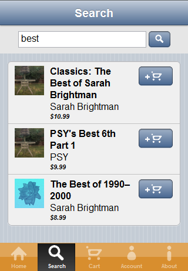

# Tutorial: Kendo Mobile Music Store: Search View

The Search View is simmilar to the Albums View but includes an input box in its header for the user to input search terms.

## Include the Input Box

The input box for search terms is included in the header so that it does not scroll with the results.

    

        <header data-role="header">
            

                
            

            

                <input type="text" class="search-text" placeholder="Album title or artist" />
                
            

        </header>
    

## Perform Search

The input box and search button are set to call the `app.searchView.submitSearch()` function to perform the search.

    submitSearch = function () {
        var filter;
        var listViewElement = $("#search-listview");
        var existingListView = listViewElement.data().kendoMobileListView;
        var viewModel = kendo.observable($.extend({
            results: data.searchList
        }, albums.baseAlbumViewModel));

        if(existingListView) {
            existingListView.destroy();
        }

        utils.scrollViewToTop(_viewElement);

        filter = _buildSearchFilter(_viewElement.find(".search-text").val());
        data.searchList.filter(filter);

        kendo.bind(listViewElement, viewModel, kendo.mobile.ui);
    }

The search is performed when the `filter()` function is called on the DataSource.
The DataSource is then bound to the ListView widget.
If the widget already existed, it is first destroyed.
This behavior is used to work around a limitation with the ListView and MVM bindings in endless scrolling mode.
For more details, see the Albums View page.

## Searching by Title or Artist

Either an artist name or an album title can be entered into the search box.
This is handled by using an "or" filter on the DataSource:

    _buildSearchFilter = function (term) {
        return {
            logic: "or",
            filters: [
                {field: "Title", operator: "contains", value: term},
                {field: "Artist.Name", operator: "contains", value: term}
            ]
        };
    }

When the search terms are sent to the server, WCF OData will automatically know to perform the search against both fields.
